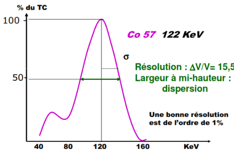
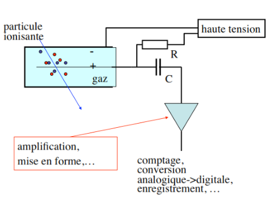
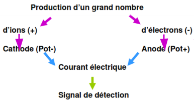
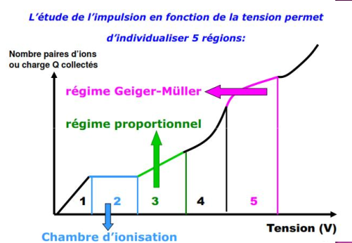

  
**INSTRUMENTATION NUCLÉAIRES**  

------------------------------------------------------------------------

  

Introduction
============

Un rayonnement peut être défini comme l'émission ou la propagation d'un
ensemble de radiations avec transport d'énergie et émission de
corpuscules, Il existe plusieurs types de rayonnements :

-   les électrons, les protons, les alphas, les pions, les muons les
    neutrinos

-   les noyaux lourds et fragments de fissions

-   les neutrons et les photons.

Les principales caractéristiques des rayonnement
================================================

-   Son origine : moléculaire, atomique ou nucléaire.

-   Sa nature : photons, particule élémentaire ou noyau lourd.

-   Sa charge : négative, nulle, positive.

-   Son énersgie : basse, intermédiaire, haute.

-   Sa période : courte, moyenne, longue.

-   Son intensité : faible, moyenne, forte.

-   Le type de réactions potentiel avec atome, noyau, nucléon.

-   Sa probabilité d'interaction faible, moyenne, élevée.

La détection d'une particule ou d'un rayonnement donné est liée à ses
interaction avec la matière, on va distinguer deux grandes familles :

-   les particules chargées

-   les particules non chargées

Les particules chargées
-----------------------

Elles se subdivisent en deux familles : les particules chargées lourdes
(ions lourds et noyaux lourds) et les particules chargées légères (les
électrons, les protons, l'alpha et les deutons)

Les particules non chargées ou neutres
--------------------------------------

Comme leur nom l'indique, il s'agit de particules électriquement : les
photons et les neutrons.

### Les photons

Appelèés aussi rayonnements électromagnétiques, les photons ont:

-   Une masse nulle

-   une énergie E proportionnelle à leur fréquence: $E=h\nu$

-   $h$ est appelée constante de Planck :
    $h = \num{6.626e-43}~\si{\joule\cdot\second\text{$^{\text{-1}}$}}$

-   $\nu$ est la fréquence en $[s^{\text{-1}}]$

 

$E_{γ}$ du photon est reliée à sa fréquence $\nu$ et à sa Longueur par:
$$E_{γ}=h\nu$$
$$E_{γ}=h\nu=\frac{hc}{\lambda}~~\rightarrow~~E_{γ_{ev}}=\frac{1240}{\lambda_{nm}}$$

| Nom                 |  longueur d'onde|     | \(m\) |  énergie|     |       |
|:--------------------|----------------:|:---:|:------|--------:|:---:|------:|
| Basses fréquences   |                 |  à  |       |         |     |       |
| Moyennes fréquences |                 |  à  |       |         |     |       |
| Hautes fréquences   |                 |  à  |       |         |     |       |
| Micro-ondes         |                 |  à  |       |         |     |       |
| Infrarouge          |                 |  à  |       |     $eV$|  à  |   $eV$|
| Visible             |                 |  à  |       |     $eV$|  à  |   $eV$|
| Ultraviolet         |                 |  à  |       |     $eV$|  à  |   $eV$|
| **Rayon X**         |                 |  à  |       |     $eV$|  à  |  $keV$|
| **Rayon γ**         |                 |  à  |       |    $MeV$|  à  |  $MeV$|
| Rayon cosmiques     |                 |  à  |       |    $MeV$|  à  |  $MeV$|

### Les neutrons

Le neutron est un nucléon de charge électriquement nulle et de masse
égale à 1838 fois la masse de l'électron ($m_{n}= \num{1.008665} u$).

Rappel sur la probabilité d'interaction
---------------------------------------

Elle est notée σ et s'exprime en ***barns***:
$1~barn = \num{e-24}~cm^{2}$.  
La notion de section efficace est liée :

-   au type de particules incidentes (photon, neutron, proton,
    électron.) à l'énergie des particules incidentes,

-   au noyau de l'isotope concerné ($^{235}U$, $^238U$, $^{239}Pu$,
    $^{3}He$, $^{1O}B$ ).

-   au type de réaction mis en jeu (absorption, diffusion, fission. ).

Les sources rayonnements nucléaires :
=====================================

-   accélérateurs:

    -   Générateurs de neutrons(Linéaires)

    -   Van de graaff

    -   Synchrotrons ou cyclotron

-   les réacteurs nucléaires

-   les sources radio-isotopiques

accélérateurs
-------------

Les accélérateurs de particules, type:

-   Générateurs de neutrons(Linéaires)

-   van de Graaff

-   Synchrotrons ou cyclotrons

Peuvent fournir des neutrons résultants du bombardement **d'une cible
appropriée par des deutons, protons, alphas, etc.**  
On peut encore utiliser le rayonnement de freinage d'un faisceau
electrons, qui produit des réactions (γ, n) telles :
$$^{9}B_{e}~(γ,n)~^{8}B_{e} \quad or\quad ^{2}H~(γ,n)~^{1}H$$ Des
accélérateurs de deutons de 100 à 200 $keV$sont très utilisés pour
constituer des générateurs de neutrons. Les réactions mise en jeu sont :
$$d~(d,n)~^{3}H_{e}, \text{qui donne des neutrons de}~\num{2.6}~\text{$MeV$}$$
$$^{3}H~(d,n)~^{4}H_{e}, \text{qui donne des neutrons de}~\num{14}~\text{$MeV$}$$
Les neutrons de 14 $MeV$sont très utilisés pour produire des actions (n,
p), (n, α) et (n, 2n).

Fonctionnement
--------------

-   Le deutérium, **contenu dans un réservoir**, diffuse à travers une
    paroi en palladium dont la perméabilité augmente avec la
    température. Puis il rentre **dans une ampoule de quartz appelée
    source d'ions** où il est ionisé par un oscillateur **de 100 M**
    avec un rendement de 80 %.

-   Ce pourcentage élevé, d'ions monoatomiques, permet de produire des
    neutrons de 14 $MeV$, lorsque les deutons accélérés par la haute
    tension de 300 $keV$ frappent une cible de tritium.

-   La réaction nucléaire qui se produit est de type: $T~(d,n)~α$.

-   Le tube permet de régler la focalisation du faisceau vers la cible
    qui est au potentiel de la terre.

-   Il est maintenu sous vide grâce à une pompe primaire à palettes et
    une pompe secondaire a diffusion d'huile, pour que les deutons ne
    soient pas freinés par l'air.

-   La cible est un disque de cuivre de 28,5 mm de diamètre, recouvert
    d'un dépôt constitué de titane et de deutérium.

\- cible  
2- Piège  
3- Trappe escamotable  
4- Tableau de commande  
5- Tube accélérateur  
6- Groupe de masse  
7- électrode HT (contenant la source d'ions)  
8- Résistance d'amortissement $10~MΩ$, $10~mA$  
9- Générateur HT $300~kV$, $3~mA$.  

Réacteur nucléaire
------------------

-   les réacteurs sont des les sources neutronique tres intense.

-   Les neutrons bombardant l'échantillon dans un réacteur nucléaire
    sont isotropes

-   résultat une irradiation homogène dans toute la masse de
    l'échantillon irradié

-   Les positions d'irradiation dans ces réacteurs déterminent le flux
    neutronique disponible pour les irradiations.

-   Les flux utilisables vont en général de 1012 à plus de 1014
    n.cm-2s-1. Selon le type de réacteur, les neutrons sont parfaitement

| Thermique | épithermique | rapids |     |
|:----------|:-------------|:-------|:----|
| environs  | enter et     | \>\>   |     |

Sources isotopiques.
--------------------

Les sources isotopiques sont portables et donnent un flux très stable de
neutrons mais le flux neutronique obtenu est beaucoup moins intense que
celui d'un réacteur nucléaire. L'émission neutronique de ces sources est
exprimée en neutrons par seconde dans un angle solide de $4π$
stéradians. Les sources sont de forme cylindrique sont en capsulées dans
une enceinte anche. L'incertitude sur l'émission neutronique est estimée
pour un intervalle de inn fiance de 99,7 % Les neutrons sont obtenus par
réactions du type (,n) ou (y,n) sur des noyaux legers. Les tableaux
ci-dessous indiquent les caractéristiques de ces sources. En plus de ces
sources, on utilise le californium 252, de période 26 ans, qui produit
des neutrons par fission spontanée : 1 ma de Cf donne 2,3.10 ns avec une
énergie de 2,3 $MeV$.

| Radionucléide | Cibl    | Période  | $E_{n}$ en $keV$ | ϕ en $n~cm^{-2}$ | ϵ en % |
|:--------------|:--------|:---------|:-----------------|:-----------------|:-------|
| $^{124}S_{b}$ | $B_{e}$ | 60 j     | 25               | à                | à      |
| $^{126}R_{a}$ | $B_{e}$ | 1620 ans | 700              | à                | à      |

-   $ϵ$ = l'incertitude maximale en

-   $ϕ$ = le flux de neutrons produit en neutron/surface/4π

-   $E_n$ = l'énergie maximale approximative des neutrons produits par
    la source.

Introduction
============

La détection de rayonnements nucléaires passe obligatoirement par leur
interaction avec le milieu détecteur.  
Ces interactions génèrent directement ou indirectement des charges
électriques lesquelles, une fois collectées sont amplifiées et
converties en signaux électriques.  
Cette opération est rendue possible grâce à la polarisation électrique
du détecteur conduisant à l'établissement d'un champ électrique
responsable du mouvement des charges produites et de leur collection.  
La détection et la mesure de rayonnements est un processus à plusieurs
étapes.  
Il s'agit dans un premier temps de faire interagir le rayonnement
incident utile avec le milieu détecteur après qu'il ait franchi l'espace
**source-détecteur**.  
Ces interactions sont ensuite converties en impulsions électriques qui
sont traitées électriquement et acheminées vers une **unité
d'acquisition et d'analyse**  
Faire l'image de la répartition de la radioactivité dans une source/un
volume:

-   Principe de l'imagerie scintigraphie quand ce volume source est un
    patient chez qui on a injecté un produit rradioactif.

La détection et la mesure de rayonnements nucléaires est une thématique
pluridisciplinaire faisant appel à des connaissances en :

-   Physique nucléaire et atomique

-   Interaction rayonnement-matière

-   Électronique

-   Acquisition, traitement et analyse du signal

-   Statistiques et interprétation des résultats.

Le taux de comptage, ne permet l'accès à l'activité de la source qu'au
moyen d'un traitement approprié prenant en compte :

-   L'efficacité de détection

-   la sensibilité de détection

-   la distance source-détecteur

-   le bruit de fond.'

Constitution d'un détecteur
===========================

-   Capteur : lieu d'interaction RI - matière

-   Système d'amplification du signal

-   Traitement signal: discriminâteur d'amplitude

-   Système d'affichage: fournit donnée mesure

    -   flux de particules : compteur

    -   Énergie particules: spectremètre

    -   Dose absorbée dans milieu: dosimètre ou débitmètre

Caractéristiques générales des détecteurs
=========================================

Différents paramètres:
----------------------

-   Efficacité de détection

-   Temps mort

-   Mouvement propre

-   Résolution en énergie

-   Caractéristiques géométriques

Classification des détecteurs
-----------------------------

-   Détecteur mettant en jeu l'ionisation des gaz

-   Détecteur à scintillations

-   Détecteur utilisant le noircissement des films photographiques

-   Détecteur à semi-conducteurs'

-   Détecteur thermoluminescents

-   Les autres:

    -   Dosimètres par résonance paramagnétique électronique

    -   Dosimètres chimiques

    -   Appareils mettant en jeu les méthodes calorimétriques…

Caractéristiques générales des détecteurs
-----------------------------------------

### Efficacité de détection $E.D$:

dépend de la nature et de l'énergie du RI

$$E.D = \frac{\text{Nombre particules reçus par détecteur}}{\text{Nombre particules détectées}}$$

### Résolution en énergie

Caractérise la qualité du détecteur à séparer 2 énergies proches.

### Le temps mort $τ$:

-   Plus petit intervalle de temps qui doit séparer deux informations
    pour être prises en compte individuellement par le système.

-   Dépend des caractéristiques du détecteur

-   Si τ court → taux de comptage **TC** $\nearrow\nearrow$

Le mouvement propre
-------------------

Il correspond au T.C enregistré en l'absence de toute source\*. Origine
du **M.P** :

-   Le Bruit de Fond **BF** naturel:

    -   radioactivité ambiante

    -   rayonnements cosmiques

-   La radioactivité propre des matériaux du détecteur

-   Le bruit de l'électronique associée'

Introduction
============

Ces détecteurs détectent le passage d'une particule chargée en mesurant
**la charge totale des électrons** et les ions produits dans
l'ionisation du milieu par la particule (formule de **Bethe-Bloch**). Le
milieu peut être de *gaz*, *liquide* ou *solide*.

Pour récupérer les électrons et les ions **avant qu'ils ne se
recombinent en atomes**, il faut la présence d'un champ électrique qui
les séparent et les font dériver vers les électrodes respectifs.

Les charges (électrons et ions) induisent des courants sur les
électrodes (figure suivante). Ces courants sont détectés par un
amplificateur qui produit un signal électronique.

Le nombre moyen de paires d'électron-ion produit dans un passage d'une
particule chargée est proportionnel à l'énergie perdue, il est donné par
la formule de **Bethe-Bloch**:

Détecteurs mettant en jeu l'ionisation des gaz
==============================================

production d'un grand nombre d'électrons
----------------------------------------

Normalement , en l'absence de tout **RI** , quelque soit la différence
de potentiel **ddp** appliquée, aucun courant ne traverse la chambre,
mais si une particule ionisante pénètre dans l'enceinte :

L'étude de l'impulsion en fonction de la tension permet
-------------------------------------------------------

Les 5 régions des détecteurs à gaz
