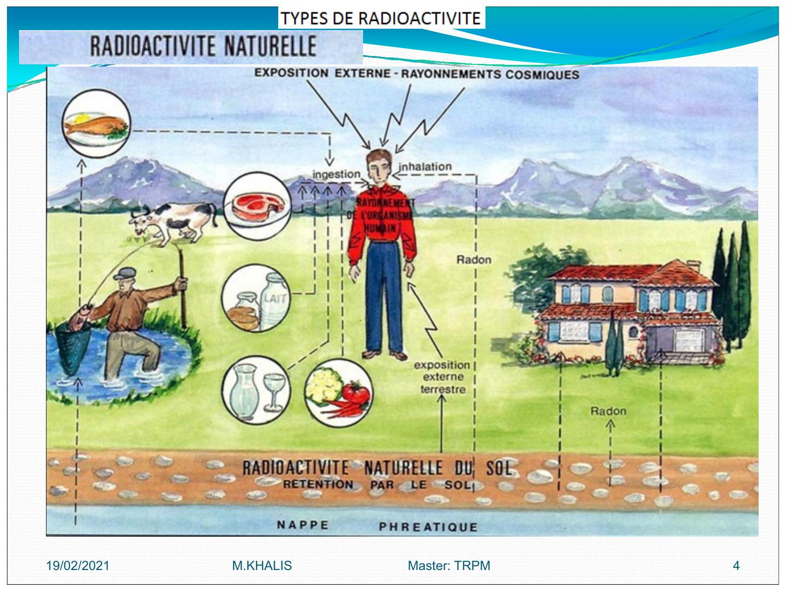

# Radioprotection
-----------------
- Cours:
    - [Chapter 1](./chapter_1.md)
    - [Chapter 2](./chapter_2.md)
    - [Chapter 3](./chapter_3.md)
- Exercices:
    - [TD 1](./td1.md)
    - [TD 2](./td2.md)
    - [QCM 1](./qcm1.md)
- Corrigé
    - [Correction TD1](./td1-cor.md)
    - [Correction TD2](./td2-cor.md)
    - [QCM 2: Énonce + Corrigé](./qcm2.md)
- [Exposé](./expose.md)

# RADIOPROTECTION
------------------

## 1.1 Principes de radioprotection 

La radioprotection repose sur trois principes fondamentaux : 
 - **Justification**: Les avantages doivent dépasser les risques engendrés 
 par l'exposition. 

 - **Optimisation** : L'exposition est à maintenir à un niveau aussi faible que possible, Dans le cadre de cette optimisation on applique le principe `ALARA` qui vise à maintenir l'exposition aux rayonnements au niveau le plus faible qu'il soit raisonnablement possible 
 d'atteindre 

 - **Limites de dose** : Les limites de dose définies par le législateur ne doivent pas être dépassées.   
     - Ceci inclut des <u>limites de dose *efficace*</u> aux organes pour éviter `les effets déterministes`  
     - et des <u>limites de dose équivalente</u> au corps pour éviter `les effets stochastiques` 

 ## 1.2 Principe ALARA : As Low As Reasonably Achievable 

 - Des mesures comme le contrôle de la contamination 
 - Une diminution de la durée d'exposition 
 - L'augmentation de la distance  
 - et l'utilisation de blindage pendant le travail avec des *radio-isotopes* 

 sont importantes pour respecter le principe `ALARA`, qui vise à maintenir les doses de rayonnement reçues par les personnes `au niveau le plus faible qu'il soit raisonnablement possible d'atteindre` compte tenu des facteurs économiques et sociaux 

 # 2 HISTORIQUE 
 ------------- 

 - **1895:** 1ère `RADIOGRAPHIE` 
     - Temps de pose : 15 $mn$ 
 	- Bertha Roentgen 
 - **1902:** Premiere effets radio induits 
 - **1928:** `CIPR` International de Protection Contre les Rayonnements 

  
  

 # RADIOACTIVITE 
 ------------------- 

## 2.1. RADIOACTIVITE NATUREL 
### 2.1.1. Quelques valeurs moyennes relatives à la radioactivité naturelle

| Active                               | mesure                  |
|:-------------------------------------| :-----------------------|
| Activite moyen de la coute terrestre | $2000 ~Bq\cdot kg^{-1}$ |
| Activite des engrais phoshates       | $5000 ~Bq\cdot kg^{-1}$ |
| Activite des pommes de terres       | $150 ~Bq\cdot kg^{-1}$  |
| Activite de l'eau de mer             | $12 ~Bq\cdot kg^{-1}$   |
| Activite du lait                     | $80 ~Bq\cdot kg^{-1}$   |
| Activite du corps humain             | $4000 ~Bq\cdot kg^{-1}$ |

  

 # Rayonnement d’origine cosmique

 L'exposition augmente avec l’altitude `vols en avion`
 - Rayonnements cosmiques sont:
     - **noyaux d'hydrogène**: protons
     - **hélium**: particules $\alpha$
     - **noyaux d'atomes plus lourds** (fer, nickel)
     - **les électrons**
 - Ce rayonnement interagit avec l'atmosphère et crée des particules secondaires (`neutrons`, `ions`, `électrons`) qui peuvent atteindre la surface de la terre 

 # RADIOACTIVITE ARTIFICIELE 

  
 la `période biologique` ou `demi-vie biologique` d'un élément chimique est de temps au bout duquel la moitie d'une quantité ingérée ou inhalé telle une drogue ou un r (radioisotope) est éliminée de l'organisme, ou a perdu son activité biologique par des processes purement biologiques (,métabolisé excretion)
  

 Pour les examens radiologiques, les données sont tirees de: 

 - Radiation Exposure in Computed Tomography, Éditeur H. D. NAGEL. COCIR. 2000 [17] 
 - Radiation Protection 118.

Referral Guidelines for Imaging.

European Commission, 2000 [18] 

 Pour les examens scintigraphiques, les activités administrées sont données à titre indicatif. 
