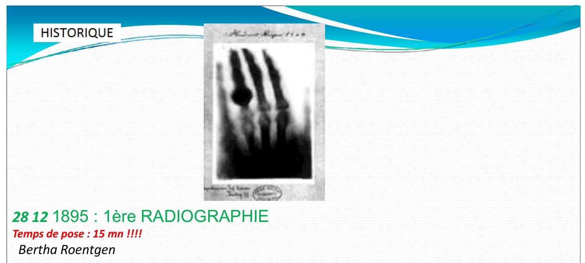
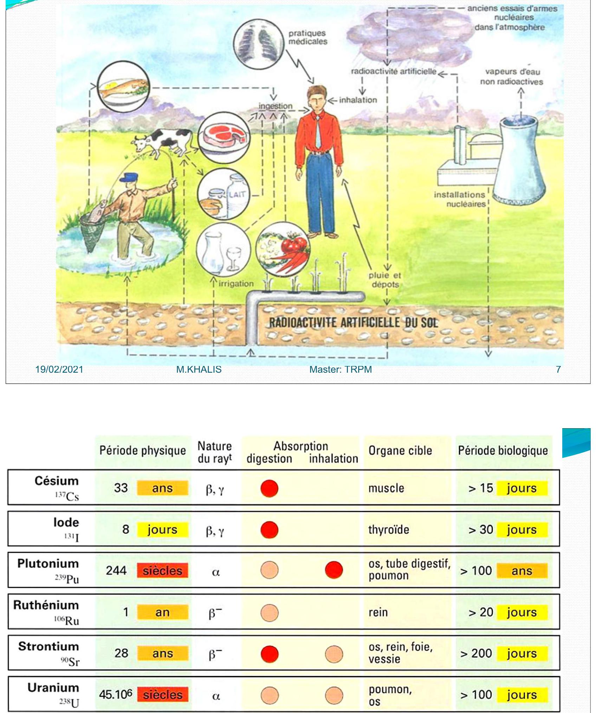
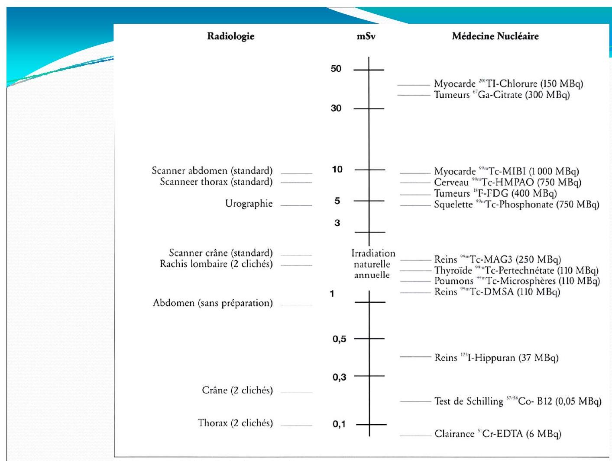
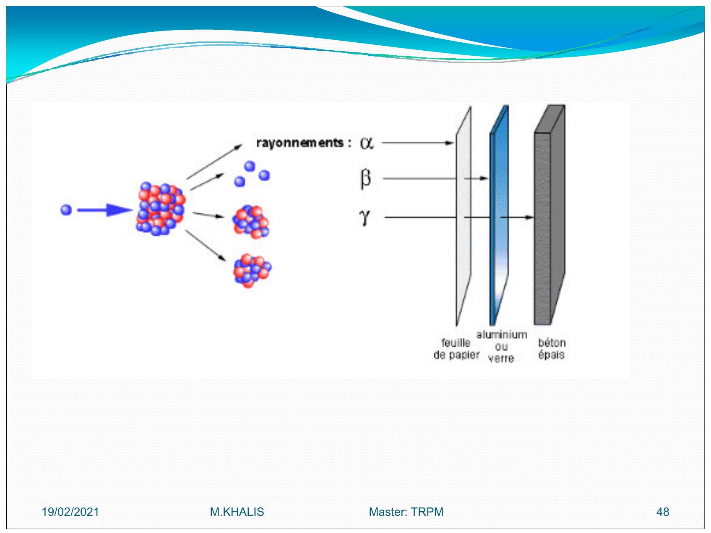
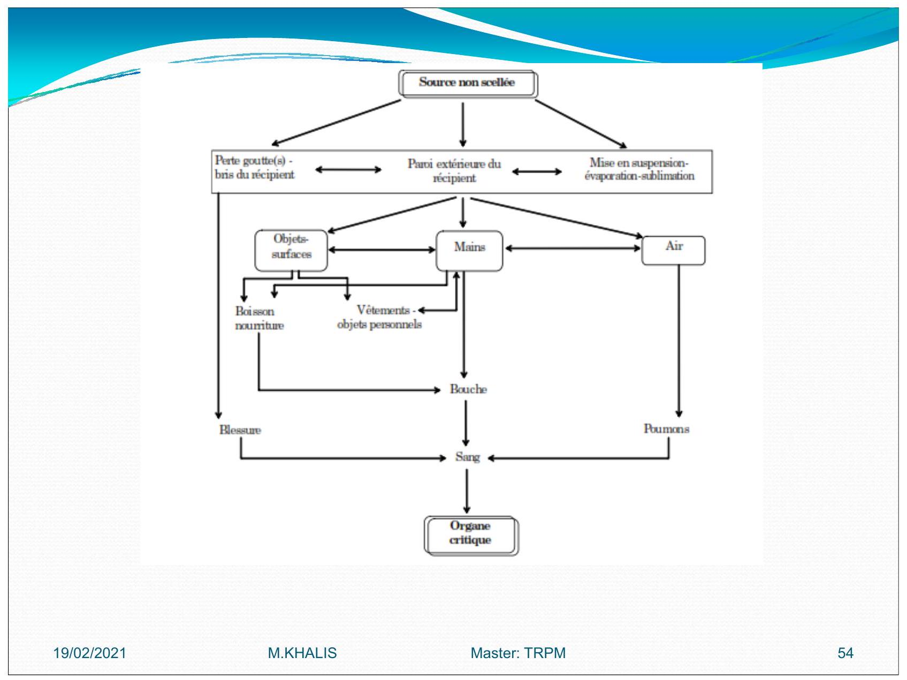
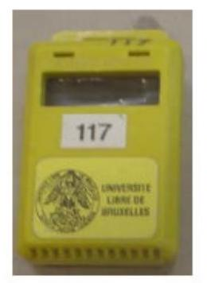
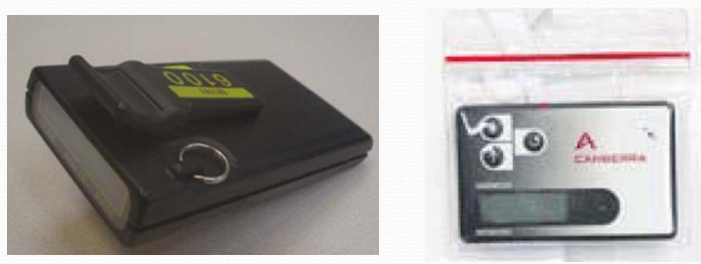
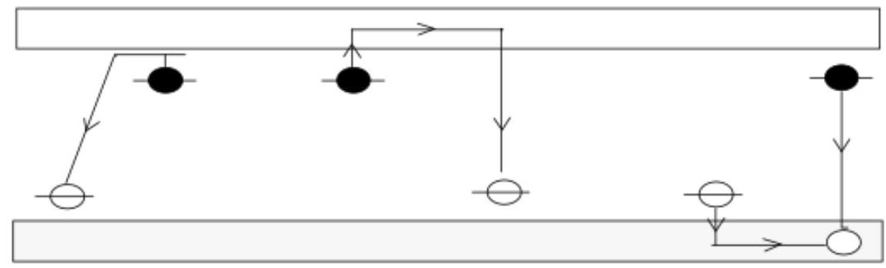

# RADIOPROTECTION
------------------

## Table des matières
- [Principes de radioprotection]()
- [Principe ALARA]()
- [HISTORIQUE]()
- [RADIOACTIVITE](#RADIOACTIVITE)
    - [RADIOACTIVITE NATUREL]()
    - [RADIOACTIVITE ARTIFICIELLE]()

 # 1. Principes de radioprotection 
 --------------------------------- 

 La radioprotection repose sur trois principes fondamentaux : 

 ## 1.1 Principes de radioprotection 

 La radioprotection repose sur trois principes fondamentaux : 
 - **Justification**: Les avantages doivent dépasser les risques engendrés 
 par l'exposition. 

 - **Optimisation** : L'exposition est à maintenir à un niveau aussi faible que possible, Dans le cadre de cette optimisation on applique le principe `ALARA` qui vise à maintenir l'exposition aux rayonnements au niveau le plus faible qu'il soit raisonnablement possible 
 d'atteindre 

 - **Limites de dose** : Les limites de dose définies par le législateur ne doivent pas être dépassées.   
     - Ceci inclut des <u>limites de dose *efficace*</u> aux organes pour éviter `les effets déterministes`  
     - et des <u>limites de dose équivalente</u> au corps pour éviter `les effets stochastiques` 

 ## 1.2 Principe ALARA : As Low As Reasonably Achievable 

 - Des mesures comme le contrôle de la contamination 
 - Une diminution de la durée d'exposition 
 - L'augmentation de la distance  
 - et l'utilisation de blindage pendant le travail avec des *radio-isotopes* 

 sont importantes pour respecter le principe `ALARA`, qui vise à maintenir les doses de rayonnement reçues par les personnes `au niveau le plus faible qu'il soit raisonnablement possible d'atteindre` compte tenu des facteurs économiques et sociaux 

 # 2 HISTORIQUE 
 ------------- 

 - **1895:** 1ère `RADIOGRAPHIE` 
     - Temps de pose : 15 $mn$ 
 	- Bertha Roentgen 
 - **1902:** Premiere effets radio induits 
 - **1928:** `CIPR` International de Protection Contre les Rayonnements 

  
 .jpg) 

 # RADIOACTIVITE 
 ------------------- 

## 2.1. RADIOACTIVITE NATUREL 
### 2.1.1. Quelques valeurs moyennes relatives à la radioactivité naturelle

| Active                               | mesure                  |
|:-------------------------------------| :-----------------------|
| Activite moyen de la coute terrestre | $2000 ~Bq\cdot kg^{-1}$ |
| Activite des engrais phoshates       | $5000 ~Bq\cdot kg^{-1}$ |
| Activite des pommes de terres       | $150 ~Bq\cdot kg^{-1}$  |
| Activite de l'eau de mer             | $12 ~Bq\cdot kg^{-1}$   |
| Activite du lait                     | $80 ~Bq\cdot kg^{-1}$   |
| Activite du corps humain             | $4000 ~Bq\cdot kg^{-1}$ |

  

 # Rayonnement d’origine cosmique

 L'exposition augmente avec l’altitude `vols en avion`
 - Rayonnements cosmiques sont:
     - **noyaux d'hydrogène**: protons
     - **hélium**: particules $\alpha$
     - **noyaux d'atomes plus lourds** (fer, nickel)
     - **les électrons**
 - Ce rayonnement interagit avec l'atmosphère et crée des particules secondaires (`neutrons`, `ions`, `électrons`) qui peuvent atteindre la surface de la terre 

 # RADIOACTIVITE ARTIFICIELE 

  
  

 Pour les examens radiologiques, les données sont tirees de: 

 - Radiation Exposure in Computed Tomography, Éditeur H. D. NAGEL. COCIR. 2000 [17] 
 - Radiation Protection 118.

Referral Guidelines for Imaging.

European Commission, 2000 [18] 

 Pour les examens scintigraphiques, les activités administrées sont données à titre indicatif. 

 ## L'ETUDE DE LA RADIOPROTECTION CONSISTE: 

 - Dans un premier temps: 
     - Schématiser la séquence des effets des radiations sur la matière vivante  
     - discuter les paramètres d'influence.  
 - Différencier les effets déterministes et les effets stochastiques 
 - Évaluer les effets et les risques d'une irradiation dans une situation donnée. 

 # Effets des radiations 
 ----------------------- 
 Les effets des radiations sur <u>la matière vivante</u> et <u>les paramètres d'influence</u> 

 ## Les effets physique, chimique et biologique 

 - **transfert d'énergie par ionisation ou par excitation** sont instantanés de l'ordre de `10-15 secondes`. 

 - **l'activation ou à la modification de réactions chimiques**.

Cette étape dure environ `10-6 secondes`. 

 ## changements biochimiques: 

Modifications sur les structures et sur les fonctions vitales qui s'étendent sur une période allant de la seconde à plusieurs années. 

Dans certain cas, ces modifications peuvent être corrigées par des mécanismes `moléculaires` ou `Cellulaires`, pour récupération des fonctions normales. 

L'effet des radiations peut aller: de *la réparation* d'une cellule Jusqu'à sa mort 

## A- Effets sur l'organisme 

En fonction de la dose délivrée, les effets des radiations sur l'organisme peuvent être: 

 - **effets déterministes**: réactions tissulaires 
 - **effets stochastiques**: aléatoires 

 ## Effets déterministes: 
 On parle la dose absorbée (en $G_y$), Lorsque la dose absorbée est supérieure à $0,5~G_y~$, 

 - On observe une réduction transitoire 
 - voire permanente 
 - des cellules assurant le fonctionnement de l'organe. 

 Quelques exemples sont donnés dans le Tableau suivant.   
 La sévérité des réactions tissulaires augmente avec la dose 

 ## Effets stochastiques 

 - **Les effets stochastiques** (ou aléatoires) sont associes à une probabilité de manifestations de conséquences suite à l'irradiation. 

 - *La quantification* du risque des effets stochastiques n'est pas possible au niveau `individuel`, mais uniquement au niveau **d'une population:** 

 > toutes les estimations de risque sur les impacts sanitaires des radiations ionisantes sont basées sur des études épidémiologiques. 

 ## Les effets stochastiques ont une manifestation tardive: 
 Ils peuvent apparaître **plusieurs années ou décennies** après l'irradiation des cellules somatiques   
 et même plusieurs générations plus tard en cas de mutations dans les cellules germinales. 

La relation entre <u>la dose</u> et <u>l'effet</u> n'est moins bien établie que pour *les fortes doses* engendrant des réactions tissulaires. 

 Tous les effets stochastiques sont la conséquence de `mutations`. **La sévérité** de ces effets ne dépend pas de la dose reçue, mais uniquement du **type de cellule et du gène muté**. 

 ### 2.1.

Types d'effets stochastiques 
1. **cancers chez l'individu irradié**, si la mutation est induite dans certains gènes des `cellules somatiques`. 

2. **maladies génétiques** dans la descendance, si la mutation est induite dans les `cellules germinales` 

3. maladies cardiovasculaire. 

**L'estimation** du risque sanitaire dû exclusivement aux *radiations ionisantes*, est difficile, `car` il est impossible d'isoler <u>les symptômes provoqués</u> par une irradiation de ceux <u>induits</u> par d'autres sources. 

 **L'estimation** du risque se base donc sur l'étude de l'augmentation de cancers et maladies dans des populations irradiées, comme celles de Hiroshima, Nagasaki et de Tchernobyl. 

 ## Autres effets somatiques 

Mis-à-part le cancer, les rayonnements ionisants peuvent provoquer d'autres maladies: 

 - maladies cardiaques  
 - des attaques cérébrales, 
 - des affections digestives,  
 - respiratoires et `hématopoiétiques` et surtout la cataracte. 

 ## Exposition prénatale 

Pendant `l'embryogenèse` la plupart des cellules sont en phase de réplication et de différenciation.

Elles ont donc une <u> radiosensibilité élevée </u>.

Des précautions particulières doivent être prises pendant le période prénatale afin de réduire l'irradiation in `utero`. 

 **Les effets embryologiques** dépendent du stade de développement: 

 - **Avant la nidation** <u>0-10 jours</u>: l'œuf est soit <u>éliminé</u> soit il <u>se développe</u> normalement `loi du tout ou rien`. 

 - **Pendant l'embryogenèse** <u>10 jours à 9 semaines</u>: le risque est maximal en raison de l'intense organogenèse.

Le seuil d'apparition des réactions tissulaires est estimé à $100 ~Gy}$. 

  - <u> Dès 3 semaines après la conception et jusqu'à la naissance</u>: l'exposition aux radiations augmente le taux de cancers chez l'enfant.

Le risque est supérieur à celui de la population en général, mais similaire à celui qui existe après une exposition pendant la petite enfance (facteur 2 à 3 ). 

  - **Pendant la phase** fotale le risque de migration neuronale anormal  persiste et peut aboutir à un retard mental.

Le seuil d'apparitions des réactions tissulaires après la roème semaine est estimé a 300 mGy. 

 # dosimètre biologique 

 - La dosimètre biologique est l'application à l'échelle moléculaire et cellulaire des connaissances des effets biologiques. 

 - Elle permet, en absence d'information de dosimètre physique, d'estimer la dose reçue. 

 - La dosimètre biologique est essentielle en cas d'accident et d'exposition à de faibles doses 

 # Risque radiologique 

 ## Notion de détriment 

 - Pour les besoins de la radioprotection, la `CIPR` a introduit la notion de `détriment` pour <u>identifier</u> et <u>quantifier</u> (lorsque cela est possible) les mauvais effets des radiations. 

 - **la notion de détriment** est limitée au préjudice sur la santé, excluant ainsi les autres formes de préjudice (social, économique, environnemental, etc). 

 - **Le détriment** est conçu comme une combinaison de *la probabilité d'incidence* de tous les effets nuisibles des radiations et de *la gravité de ces effets*. 

 ## En considération des niveaux de dose mis en cause en radioprotection 

 - Seuls **les effets stochastiques** sont pris en compte. 

 - Ceci comprend notamment: 
     - la probabilité d'un cancer mortel attribuable aux rayonnements  
  la probabilité pondérée d'un cancer non mortel attribuable aux rayonnements  
     -  la probabilité pondérée d'effets héréditaires grave et la durée de vie perdue, si le préjudice a lieu 

 # Notion de dose effective ou efficace 

 Pour évaluer <u>l'importance</u> de l'impact biologique **d'une exposition aux rayonnements ionisants** et <u>comparer</u> les expositions entre elles, la radioprotection utilise la dose efficace : 

 **La dose efficace:** c'est une grandeur calculée, exprimée en *millisieverts* $mv}$ 

 Elle prend en compte non seulement <u>la quantité d'énergie</u> absorbée par le corps, mesurée en grays $Gy$ (cède), mais aussi <u>la nature</u> des rayonnements émis et <u>la sensibilité biologique</u> aux rayonnements des tissus et <u>organes exposés</u>.  

 > Dose équivalente $H_{T}$ : dose absorbée par le tissu ou l'organe $T$, pondérée suivant le type et la qualité du rayonnement R. 

 Elle est donnée par la formule : 

 $$H_{T, R}=W_{R} D_{T, R}$$ 
 Où : 
 - $D_{T, R}$ est la moyenne pour l'organe ou le tissu $T$ de la dose absorbée du rayonnement $R$ 

 - $W_{R}$ est le facteur de pondération radiologique. 

 <u>Valeurs du facteur de pondération radiologique $W_{R}$</u> 

 | Type de rayonnement            |  Energie          | $W_{R}$ | 
 |:-------------------------------|:------------------|:--------| 
 | Photons                        | toutes énergies   | 1       | 
 | Electrons, muons               | toutes énergies   | 1       | 
 | Neutrons                       | $E<10 KeV$        | 5       | 
 |                                | $10<E<100 keV$    | 10      | 
 |                                | $100~KeV<E<2~MeV$ | 20      | 
 |                                | $2~MeV<E<20~MeV$  | 10      | 
 |                                | $>20~MeV$         | 5       | 
 | Protons                        | $E>2~MeV$         | 5       | 
 | Particules\*                   |                | 20      | 

 Particules: alpha, fragments de fission, noyaux lourds  

 Lorsque le champ de rayonnement comprend des rayonnements de <u>types</u> et <u>d'énergies</u> correspondant à des valeurs différentes de $W_{R}$, `la dose équivalente` totale $H_{T}$ est donnée par la formule : 
 $$H_{T}=\sum~W_{R}~D_{T,R}$$ 
 L'unité de dose équivalente est le sievert `Sv`. 

 **Dose efficace E:** somme des doses équivalentes pondérées délivrées aux différents tissus et organes du corps mentionnés à l'annexe II par l'irradiation interne et externe.

Elle est définie par la formule: 

 $$E=\sum~W_{T}~H_{T}=\sum W_{T}~\sum W_{R}~D_{T, R}$$ 

 Où : 
 - $D_{T, R}$ est la moyenne pour l'organe ou le tissu $T$ de la dose absorbée du rayonnement $R$; 

 - $W_{R}$ est le facteur de pondération radiologique 

 - $W_{T}$ est le facteur de pondération tissulaire valable pour le 
   tissu ou l'organe $T$. 

 <u>Valeurs du facteur de pondération tissulaires</u> $W_{T}$ 

 | Tissu ou organe |  $W_{T}$ | 
 |:----------------|:---------| 
 | Gonades         |  $0.20$  | 
 | Moelle rouge    |  $0.12$  | 
 | Colon           |  $0.12$  | 
 | Poumons         |  $0.12$  | 
 | Estomac         |  $0.12$  | 
 | Vessie          |  $0.05$  | 
 | Seins           |  $0.05$  | 
 | Foie            |  $0.05$  | 
 | Esophage        |  $0.05$  | 
 | Thyroïde        |  $0.05$  | 
 | Peau            |  $0.01$  | 
 | Surface des os  |  $0.01$  | 
 | Autres          |  $0.05$  | 

 [ANNEXE II]() 

 L'unité de dose efficace est le Sievert `Sv`. 

 **Sievert** `Sv`: nom de l'unité de *dose équivalente* ou de *dose efficace*.

Un Sievert équivaut à un joule par kilogramme, 

 Pour les photons et électrons de toutes énergies : 
 $$1~Sv=1 ~ \cdot kg^{-1}$$  

 **Limites de dose:** 
 - valeurs maximales fixées dans un règlement pour les doses résultant de l'exposition des personnes professionnellement exposées 
 - des apprenti(e)s et des étudiant(e)s 
 - ainsi que des autres personnes du public, aux rayonnements ionisants visés par le présent règlement  
 - et qui s'appliquent à la somme des doses concernées résultant de sources externes de rayonnement pendant la période spécifiée  
 - et des doses engagées sur cinquante années (jusqu'à l'âge de 70 ans pour les enfants) par suite des incorporations pendant la même période 

 | catégorie de personne                 |   Limite dose efficace                               | 
 |:--------------------------------------|:-----------------------------------------------------| 
 | Personne professionnellement exposée  | $20~mSv$                                             | 
 | Apprentis ou étudiants de 16 à 18 ans | $6~mSv$                                              | 
 | Public                                | $1~mSv$                                              | 
 | Femmes enceintes                      | - maximum $1~mSv$ durant la grossesse                | 
 |                                       | - interdiction de manipuler des sources non scellées | 

 En ce qui concerne les organes ou tissus pris individuellement, les limites sont les suivantes: 
 |:-------------------------------------------------|:-----------------| 
 | Peau                                             | $500~mSv$         | 
 | Main, avant-bras, pieds, chevilles               | $150~mSv$         | 
 | Cristallin                                       | $100~mSv$         | 
 | Gonades                                          | $167~mSv$         | 
 | Moelle rouge, colon, poumons, estomac            | $400~mSv$         | 
 | Vessie, seins, foie, oesophage, thyroïde, autres |                      4                     | 

 # Contrainte dedose: 

 Restriction imposée aux doses éventuelles qu'une source peut délivrer aux individus et utilisée à des fins d'optimisation, dans la phase de planification de la protection contre les rayonnements ionisants. 

 > Pour les professionnels de la radioprotection, il est nécessaire de donner certaines définitions: 

 ## Source scellée : 

Source constituée par des substances radioactives solidement incorporées dans des matières solides et effectivement inactives présentant une résistance suffisante pour éviter, dans des conditions normales d'emploi, toute dispersion de substances radioactives. 

## Source orpheline : 

 Une source scellée dont le niveau d'activité au moment de sa découverte est supérieur au niveau d'exemption et qui n'est pas sous contrôle réglementaire. 

 - soit parce qu'elle n'a jamais fait l'objet d'un tel contrôle. 
 - soit parce qu'elle a été abandonnée, perdue, égarée, volée ou transférée à un nouveau détenteur sans modification en bonne et due forme à l'autorité compétente ou sans que le destinataire en ait été informé. 

 **Source scellée de haute activité**, en abrégé `SSHA` : source scellée contenant *un radionucléide* dont l'activité au moment de la fabrication ou, si ce moment n'est pas connu, au moment de la première mise sur le marché ou au moment de l'acquisition par le détenteur est égale ou supérieure au niveau d'activité visé à [l'annexe VI](). 

 **Conteneur de source :** enceinte de confinement d'une source scellée de haute activité ne faisant pas partie intégrante de la source, mais destinée à permettre le transport, la manutention, le stockage etc. 

 **Déchets radioactifs :** toutes substances radioactives provenant d'une pratique autorisée ou d'une activité professionnelle, traitée en tout ou en partie, comme une pratique non exemptée en vertu de l'article 9.3, et pour laquelle aucun usage ultérieur n'est prévu au sein de l'établissement. 

 **Elimination de déchets radioactifs** : rejet de déchets radioactifs directement dans l'environnement ( $y$ compris sous forme d'incinération), avec dispersion ultérieure et absence d'intention de récupération, ou stockage de déchets radioactifs dans un dépôt définitif, y compris sous forme de mise en décharge, sans intention de récupération. 

 **Intervention** : activité humaine destinée à prévenir ou à réduire l'exposition des individus aux rayonnements ionisants à partir de sources qui ne font pas partie d'une pratique ou ne sont pas maîtrisées, en agissant sur les sources de rayonnement ionisant, les voies d'exposition et les individus eux-mêmes. 

 **Personnes professionnellement exposées** : personnes, travaillant à leur compte ou pour un employeur, soumises pendant leur travail à une exposition provenant de pratiques visées dans le présent règlement et susceptible d'entraîner des doses supérieures à l'une quelconque des limites de dose fixées pour les personnes du public, ou soumises pendant leur travail à une exposition provenant d'activités professionnelles autorisées en application des dispositions du présent règlement. 

 **Personnes professionnellement exposées de catégorie A** : les personnes professionnellement exposées qui sont susceptibles de recevoir une dose efficace supérieure à 6 millisievert par 12 mois consécutifs glissants ou une dose équivalente supérieure aux trois dixièmes des limites de dose fixées à l'article $20.1 .3$ pour le cristallin, la peau et les extrémités. 

 **Personnes professionnellement exposées de catégorie B** : les personnes 
 professionnellement exposées qui ne relèvent pas de la catégorie $A$ 

 **Personnes du public** : individus de la population, à l'exception des personnes professionnellement exposées, des apprenti(e)s et des étudiant(e)s pendant leurs heures de travail. 

 **Population dans son ensemble**: toute la population comprenant les personnes professionnellement exposées, les apprenti(e)s, les étudiant(e)s et les personnes du public. 

 **Enfantà naître** : être humain, depuis la conception jusqu'à la naissance Zone contrôlée : zone soumise à une réglementation spéciale pour des raisons de protection contre les rayonnements ionisants et de confinement de la contamination radioactive, et dont l'accès est réglementé; dans les établissements autorisés en vertu des dispositions du présent règlement, toute zone dans laquelle les trois dixièmes des limites de dose annuelle fixées pour les personnes professionnellement exposées sont susceptibles d'être dépassés doit constituer une zone contrôlée 

 **Zone surveillée** : zone faisant l'objet d'une surveillance appropriée à des fins de protection contre les rayonnements ionisants; dans les établissements autorisés en vertu des dispositions du présent règlement, toute zone dans laquelle un individu pourrait être soumis à une exposition susceptible d'entraîner des doses supérieures à l'une quelconque des limites de dose fixées pour les personnes du public et qui n'est pas considérée comme une zone contrôlée doit constituer une zone surveillée ou y être incluse.

Démantèlement : ensemble des opérations administratives et techniques et des travaux nécessaires ou conduisant à la cessation de l'exploitation d'une installation et à sa mise dans un état sûr pour les travailleurs, la population et l'environnement 

 Exploitant : toute personne physique ou morale qui assume la responsabilité de l'établissement ou de l'activité professionnelle devant faire l'objet d'une autorisation ou d'une déclaration au sens du chapitre II 

 **Entreprise extérieure** : toute personne physique ou morale, appelée à exécuter une opération de quelque nature que ce soit en zone contrôlée d'un établissement, à l'exception de l'exploitant de cet établissement et des membres de son personnel. 

**Travailleur extérieur** : toute personne professionnellement exposée qui exécute une opération de quelque nature que ce soit en zone contrôlée, qu'elle soit employée à titre temporaire ou permanent par une entreprise extérieure, y compris les stagiaires, apprenti(e)s et étudiant(e)s ou qu'elle preste ses services en qualité de travailleur indépendant, y compris les médecins indépendants dans les hôpitaux; les travailleurs extérieurs doivent être considérés comme des travailleurs professionnellement exposés de catégorie A Protection efficace : dispositif de protection contre les rayonnements ionisants tel que la dose délivrée à toute personne soit aussi faible que raisonnablement possible et en tout cas n'excède pas les limites de dose fixées au chapitre III.

**Service de dosimètre agréé** : organisme responsable de l'étalonnage, de la lecture ou de l'interprétation des appareils de contrôle individuels, ou de la mesure de la radioactivité dans le corps humain ou dans des échantillons biologiques, ou de la détermination des doses, et dont la qualification pour cette tâche est reconnue par l'Agence.

**Service agréé de médecine du travail** : section ou département chargé de la surveillance médicale du service pour la prévention et la protection au travail de l'entreprise en question, visée aux arrêtés royaux du 27 mars 1998 relatifs aux services internes et externes pour la prévention et la protection au travail.

**Médecin agréé **: le conseiller en prévention -médecin du travail de la section ou du département chargé de la surveillance médicale du service pour la prévention et la protection au travail de l'entreprise en question, responsable du contrôle médical des personnes professionnellement exposées et agréé selon la procédure décrite à l'article75.

**Expert qualifié en contrôle physique** : personne ayant les connaissances et l'entraînement nécessaires, notamment pour effectuer des examens physiques, techniques ou radiochimiques permettant d'évaluer les doses et pour donner des conseils afin d'assurer une protection efficace des individus et un fonctionnement correct des moyens de protection, conformément aux dispositions de la loi

# 8) BASES DE LA RADIOPROTECTION  [bases-de-la-radioprotection]

Le but de la radioprotection est *d'empêcher* ou réduire ces risques, lies aux rayonnements, afin d'éviter ou réduire la radioprotection s'appuie sur trois grands principes

- **la justification** des activités comportant un risque d'exposition à des rayonnements ionisants ;

- **l'optimisation** des expositions à ces rayonnements au niveau le plus faible possible ;

- **la limitation** des doses d'exposition individuelle à ces rayonnements.

> Ces trois principes fondamentaux découlent du principe général de précaution: le principe `ALARA` : As Low As Reasonably Achievable» ou bas que raisonnablement possible

# Principe de justification

Justification toute activité faisant intervenir un risque radiologique doit être justifiée <u>c'est-à-dire</u> le bénéfice positif
Penser à des procédures alternatives qui doivent être analysées et retenues le cas échéant.

L'examen demandé peut-il être remplacé par un examen non irradiant?
- Performances égales ?
- Disponibilité ?
- Coût ?
- Risques et inconvénients respectifs?

> IRM et ECHOGRAPHIE

- L'expression d'une question clinique

    - Clairement formulée
    - Dont la réponse contribue à la décision médicale

- Un examen dont on connaît le coût/efficacité

    - Les performances
    - La pénibilité
    - Les risques
    - Le coût financier

# fin

# Principe d'optimisation 

La mise en évidence des `effets stochastiques` des radiations et `l'hypothèse d'une absence de seuil` pour de tels effets <u>conduisent</u> naturellement à l'exigence de l'optimisation.

Il s'agit ainsi de maintenir les doses aussi faibles que cela est raisonnablement possible (principe `ALARA` : As low As Reasonably Achievable).

## Principe de limitation des doses
L'application des principes de justification et d'optimisation, est
conduire à ce qu'un petit nombre d'individus reçoivent des doses trop élevées.

Pour cette raison, <u>On doit</u> définir :**la limitation des doses**.

Les principes de la radioprotection sont adaptés à
trois catégories de population :On distingue 
- **Les professionnels**:

    - <u>Directement Affectées </u>à des Travaux utilisant des Rayonnements ionisants (DATR) ou catégorie A. (par exemple les manipulateurs d'électroradiologie ou de médecine nucléaire).

    - <u>Non Directement Affectées </u>à des Travaux utilisant des Rayonnements ionisants (NDATR) ou catégorie B (par exemple les secrétaires médicales d'un service d'électroradiologie ou de médecine nucléaire).

- **Les Patients**: Le patient et les proches du patient en tant qu'aides dans les soins ainsi que les personnes exposées dans le cadre d'études biomédicales
- **Le public**: Rayonnements et environnement de santé, L'autorité de sûreté nucléaire doit contrôler la bonne application du système de radioprotection

# Principes de base de radioprotection
Les principes élémentaires à mettre en place pour assurer une bonne protection face aux radiations ionisantes peuvent être résumés ainsi :

- soin, ordre
- temps
- distance
- et blindage

## Temps d'exposition
Le temps pendant lequel une personne est exposée à une source radioactive doit être réduit au minimum nécessaire.

Pour ce faire, quelques règles simples peuvent être appliquées :

- avoir une bonne connaissance du mode opératoire
-  ne sortir une source de son blindage que le temps nécessaire
- ne pass séjourner inutilement près d'une source de rayonnements ionisants

Dans certains cas particuliers, il convient d"effectuer une rotation du personnel afin d'éviter un dépassement des limites de doses.

## Protection par la distance
Les rayonnements issus d'une source radioactive sont a priori émis dans toutes les directions.

Tous les endroits irradiés de la même manière se situent à la surface $d^{\prime}$ une sphère dont le centre est une source ponctuelle.

Par conséquent, la dose va suivre la loi de l'inverse du carré de la distance selon
$$ \frac{D_{1}}{D_{2}}=\frac{\left(d_{2}\right)^{2}}{\left(d_{1}\right)^{2}} $$
A titre d'exemple, le simple fait de prendre une source à l'aide d'une pince la distance passant de 1 à $10 ~cm$, la dose diminue d'un facteur 100 au niveau des mains.

# Protection par interposition de blindage
L'interposition de blindage entre la source et le personnel permet également une limitation des doses reçues.

En fonction des différents types de rayonnements et de leur énergie, il conviendra d'adapter le blindage mis en place.

De manière générale, on peut dire que $5$ à $6 ~cm$ d'air suffisent pour arrêter les rayonnements $\alpha$.

Les rayonnements $\beta$ sont quant à eux relativement faciles à arrêter.

Les rayonnements émis par le phosphore 32 seront complètement arrêtés par $8 ~mm$ d'eau.

Les rayonnements $\gamma$ et $X$ sont généralement très pénétrants; ils nécessitent donc des épaisseurs de blindage plus élevées.

Leurs énergies étant très variables (de quelques `keV` à plusieurs `MeV`), il est impossible d'établir une règle générale du type `autant de cm de plomb suffisent`.

Il faudra étudier le blindage de ces sources au cas par cas

# Particularité des sources $\beta$ pures
il est conseillé de réaliser les blindages à l'aide de matériau dont le numéro atomique est faible.` Car`, un matériau dont le numéro atomique est lourd, tel que le plomb.

Un rayonnement de freinage (appelé Bremsstralhung)

> principe physique utilisé dans les appareils de radiologie pour produire les rayons $X$.

Par exemple, dans le cas du $P^{32}$, le blindage sera généralement constitué de plaques de plexiglas d'un `cm` d'épaisseur.
.jpg)
**transparent**: il est plus simple de travailler derrière ce type d'écran.

Selon **G. Sitzlack** il est possible de calculer le rayonnement de freinage produit à l'aide de la relation empirique suivante :
$$ \dot{H}=0,26 \cdot \frac{Z \cdot A}{r^{2}} \cdot E^{2} $$
dans laquelle:
- $\dot{H}$: débit de dose en $mSv\cdot h^{-1}$;
- $Z$ : numéro atomique du matériau absorbant les électrons;
- $A$ : activité en $GBq$;
- $r$ : distance à la source en $cm$;
- $E$ : $E_{\max } \operatorname{des} \beta$ en $MeV$.

Attention, cette formule n'est valable que si tout le rayonnement $\beta$ est absorbé !

# Modes d'expositions

## Exposition externe
-  On est à coté d'une source de rayonnement.
-  Elle est due essentiellement au rayonnement gamma.
-  L'exposition externe due au rayonnement alpha peut être négligé.

## Exposition interne
Par inhalation de l'air contaminé ou ingèrer des aliments, contaminés,contamination interne de son organisme.

L'exposition interne concerne tous les types de rayonnements car il n'y a plus d'écran pour arrêter `les alpha` et `les bêta`.

Si la source est en contact direct avec la peau, on parle de contamination qui engendre une exposition `externe` et qui peut également engendrer une exposition `interne` si la substance radioactive pénètre dans le corps (par une blessure, une coupure ou les pores de la peau).

# Comment éviter les risques dans les laboratoires

Les sources utilisées dans les laboratoires sont de 2 types :

- **Les sources scellées** (c'est-à-dire sources dont la structure empêche, en utilisation normale, toute dispersion de substances radioactives dans le milieu ambiant) servant essentiellement à la calibration d'appareils de mesure.

Avec ce type de sources, seule l'irradiation est à craindre.
Les mesures de protection seront essentiellement axées sur le blindage lorsque la source n'est pas utilisée.

- **Les sources non scellées** : dans ce cas, à l'irradiation, viendra s'ajouter le risque de contamination interne et/ou externe.

Le schéma présenté ici permet de situer les différents points sur lesquels il y a moyen d'intervenir afin de diminuer le risque de contamination interne.

## Ce qu'il faut faire ...
Afin de diminuer les risques le plus possible, voici quelques règles très simples à mettre en place :

- porter une blouse de laboratoire
- Porter des gants à usage unique
- Protéger le plan de travail (par ex: avec du papier type benchkote)
- Étiqueter chaque objet contaminé
- Effectuer régulièrement des mesures de contaminations
- Récupérer les déchets radioactifs dans les récipients ad hoc
- Porter son dosimètre et le remettre régulièrement pour lecture

## Ce qu'il ne faut pas faire ...

-  pipeter à la bouche
-  boire, fumer, manger dans les laboratoires
-  introduire des objets personnels
-  mélanger activités de bureau et activités de laboratoire
-  mélanger du matériel radioactif et non radioactif
-  toucher des objets non contaminés avec des gants contaminés (téléphone, ...)

# La dosimétrie est un aspect essentiel de la radioprotection
-------------------------------------------------------------
# 1er partie: Aspects théorique
- **dosimétrie**, c'est-à-dire la mesure de l'exposition aux radiations ionisantes, fait partie des outils le la radioprotection, Elle a pour objet de mesurer au mieux les rayonnements en un lieu ou sur une personne (on parle alors de dosimétrie individuelle), pour fournir une estimation de l'équivalent de lose et de dose efficace.
- grande variété des situations et des rayonnements a conduit à une grande diversité de ces létecteurs qui doivent en outre s'adapter régulièrement aux changements des limites réglementaires (c'est parfois même leurs améliorations qui permettent de définir de nouvelles imites)
- **dosimétrie individuelle** permet une surveillance radiologique (vérification que les doses reçues ont dans les limites réglementaires), mais elle doit aussi apporter le maximum d'informations en :as d'irradiations accidentelles et si possible servir d'alarme dans ces situations.

Enfin les dosimètres doivent pouvoir fonctionner dans des environnements très variés (température, humidité, orientation, etc.), ce qui affecte en général leur précision.

# Dosimétrie

# Badge poitrine
Toute personne professionnellement exposée doit porter un dosimètre à hauteur de poitrine sauf pour une exposition exclusive à des émetteurs $\beta$ dont l'énergie est inférieure à $200~keV$.

En pratique, toute personne ne manipulant que du $H^{3}(18.6~keV)$, du $C^{14}(156~keV)$ ou du $S^{35}(167~keV)$ ne doit pas porter de dosimètre.

Dans ces cas, il convient de mettre en place un système de monitoring adéquat (par exemple, contrôle des urines, ...)

# Dosimètre supplémentaire
Si une irradiation non négligeable des tissus ou d'un organe est à craindre, la personne portera un ou plusieurs dosimètres supplémentaires permettant de mesurer la dose à ces endroits.

.jpg)

Dans le cas où l'irradiation est susceptible de provoquer une dose supérieure aux $3/10$ des limites pour le cristallin, les mains, les avant-bras, les pieds ou les chevilles, ces dosimètres supplémentaires seront toujours portés.

## exemples
le personnel de radiologie devant maintenir le patient pendant la prise du cliché (et plus particulièrement les enfants et les nourrissons), toute personne travaillant en radiologie interventionnelle, lors de l'injection de substances radioactives aux patients, toutes ces personnes porteront un dosimetre(*bague ou bracelet*).

## Dosimétrie opérationnelle
Toute personne susceptible de recevoir une dose supérieure à $500~\mu Sv$ par semaine portera à hauteur de la poitrine un dosimètre à lecture directe

Dans les situations où le port d'un tablier plombé est indiqué, `il y a lieu de porter 2 dosimètres`, l'un au-dessus, l'autre en-dessous du tablier plombé.

> Tout visiteur, travailleur extérieur, stagiaire, étudiant et personnel intérimaire doit porter le mêmes moyens de protection que les travailleurs régulièrement occupes dans la zone et parconséquent du même type de dosimètre que celui utilisẻ par le personnel régulier.

# La thermoluminescence
la thermoluminescence:capacité d'un matériau d'émettre de la lumière lorsqu'il est chauffé, la quantité de lumière émise étant proportionnelle à la quantité de rayonnements ionisants reçus par ce matériau.

Les matériaux thermoluminescents sont essentiellement des cristaux isolants dans lesquels on a introduit des impuretés chimiques (ou activateurs) en quantités soigneusement contrôlées.

Lorsque ces matériaux sont irradiés par des rayonnements ionisants, une fraction minime de l'énergie du rayonnement absorbé est emmagasinée dans des états d'énergie métastables.

En dosimétrie par thermoluminescence, l'énergie absorbée et emmagasinée dans le matériau détecteur est libérée par échauffement, ce qui se traduit par une émission de lumière, dont l'intensité est liée à la dose de rayonnement.

L'information dosimétrique étant perdue au cours de la lecture, les détecteurs thermoluminescents ne peuvent habituellement être lus qu'une fois. Cependant, ils sont réutilisables.

Divers matériaux détecteurs sont actuellement disponibles dont le fluorure de lithium $LiF$, le borat de lithium $Li_{2} ~B_{4} O_{7}$, le fluorure de calcium $CaF_{2}$, le sulfate de calcium $CaSO_{4}, \ldots$ Leur réponse à différents types de rayonnements ionisants dépend de divers paramètres, tels qu leur composition isotopique, l'épaisseur du détecteur,...

## Modèle de niveaux d'énergie

.jpg)
Ce schéma représente les bandes de valence et de conduction, ainsi que les niveaux d'énergie associés aux pièges à électrons et à trous introduits dans le cristal par les activateurs, c'est-à-dire les impuretés chimiques et les défauts réticulaires.

Si le cristal est irradié, l'énergie est transmise aux électrons de la bande de valence et les fait passer dans la bande de conduction, en laissant des trous dans la bande de valence (figure a).

Certains de ces électrons et trous se recombinent immédiatement, d'autres sont piégés dans les états métastables où ils peuvent subsister pendant très longtemps.

L'échauffement du cristal libère les électrons et les trous de leurs pièges et les amène à se recombiner, soit rapidement (figure b), soit après avoir erré à travers le cristal dans la bande de conduction (figure c) ou dans la bande de valence (figure d).

Dans tous les cas, il y a émission de lumière.

Dans la plupart des matériaux utilisés, il existe un certain nombre de pièges situés à des niveaux d'énergie différents, si bien que la courbe de thermoluminescence présente habituellement plusieurs pics.

La répartition des niveaux d'énergie des pièges, et donc le tracé de la courbe de thermoluminescence, dépend de plusieurs paramètres, dont le plus important est le passé thermique du matériau thermoluminescent considéré.

Bande de conduction

Bande de valenceb Crecombinaison

# courbe de thermoluminescence.
Dans la plupart des matériaux utilisés, il existe un certain nombre de pièges situés à des niveaux d'énergie différents, si bien que la courbe de thermoluminescence présente habituellement plusieurs pics.

La répartition des niveaux d'énergie des pièges, et donc le tracé de la courbe de thermoluminescence, dépend de plusieurs paramètres, dont le plus important est le passé thermique du matériau thermoluminescent considéré.

.jpg)

Courbe de thermoluminescence du $LiF$ 

La répartition spectrale de l'émission de thermoluminescence varie d'un matériau à l'autre et entre les divers pics de la même courbe de thermoluminescence.

Dans le cas du dosimètre (LiF:Mg, Ti) la luminescence principale se situe à $230^{\circ} C$ pour un maximum du spectre d'émission situé à $400 ~nm$.

La réponse de la plupart des matériaux thermoluminescentsen fonction de la dose absorbée est linéaire sur une large gamme de dose.

Dans le cas du LiF, la réponse est linéaire jusqu'à une dose gamma d'au moins $5 ~Gy$ (500 rad).

Leurs pièges respectifs est une fonction de la température.

Lorsque les pièges sont peu profonds, cette probabilité n'est pas négligeable à température ambiante.

Par conséquent, une partie de l'information peut être perdue au cours de la période de stockage du dosimètre entre l'irradiation et la lecture.

C'est ce qu'on appelle le `fading`.

Un traitement thermique adéquat lors de la lecture permet de minimiser ce phenomene.

# $2^{\text {eme }}$ partie : Aspects pratiques

- Gestion: demande?
- la réception?
- la lecture etc..

$
\begin{array}{llll}
  \text { Fonction : } & \square \quad \text { Etudiant } & \square \text { Chercheur, doctorant } \\
  & \square \quad \text { Médecin } & \square \text { Technicien } \\
  & \square \quad \text { Infirmier(e) } & \square \text { Autre (à préciser) ......... }
\end{array}
\\

\text {Service~~~: ...............................}\\
\text {Campus  : ...............................}\\
\text{Matricule (chez employeur ou étudiant)}
\\
\begin{array}{llll}
  \text { Employeur : } &\square \quad U.L.B  \\
                        & \text { Institut Bordet : } & \square \quad \text{U.L.B} \\
                        &                           & \square \quad \text{Institut Bordet} \\
                        &                           & \square \quad \text{Centre des Tumeurs} \\
                        &\square \quad \text {C.H.U. Saint Pierre} \\
                        &\square \quad \text {C.H.U. Brugmann} \\
                        &\square \quad \text {H.U.D.E.R.F.} \\
                        &\square \quad \text {Hôpital Erasme} \\
                        &\square \quad \text {C.P.A. S. B.} \\
                        &\square \quad \text {Société d'intérim: ..............................................} \\
                        &\square \quad \text {Durée probable de l'intérim:...............................} \\
\end{array}
$

## Quelques recommandations .....

-  Portez votre dosimètre
-  Remettez-le régulièrement afin que nous puissions le lire et vous transmettre les résultats
-  Chaque dosimètre est nominatif, portez celui qui vous est attribué
-  Ce dosimètre est réutilisable, NE LE JETEZ PAS APRES USAGE !
-  La fenêtre noire est fragile, ne la percez pas.
-  Ce dosimètre est sensible aux U.V. : ne l'exposez pas au soleil, ....
-  N'essayez pas de l'ouvrir, vous le casseriez !
-  Lorsque vous passez un examen isotopique ou radiologique en tant que patient, ne portez pas votre dosimètre
-  Pour tout problème concernant votre dosimètre, n'hésitez pas, contactez le Service de Contrôle Physique.

## Protection lors de l'utilisation des installations mettant en oeuvre des ravons $X$

Les conditions d'utilisation les plus courantes sont de l'ordre de $40~kV$ et $30 ~mA$.

Dans ces conditions, le pouvoir pénétrant du rayonnement est faible, mais par contre le débit de dose est énorme.
De plus, le faisceau étant tellement étroit, le dosimètre a peu de chances d'être dans la trajectoire du faisceau lors d'un incident.

L'accent devra donc être mis sur la sécurité intrinsèque de l'appareil pour prévenir tout incident. 2 types d'installations

## Appareils autoblindés
L'appareil autoblindés est se trouvant dans une enceinte blindée.

Les installations récentes sont complètement enfermées dans des enceintes blindées et ne posent pas de problèmes majeurs.

Néanmoins, une installation de ce type doit répondre aux obligations suivantes :

- un signal lumineux doit s'allumer lorsque la haute tension est appliquée (si ce signal est défectueux, la haute tension ne devrait pas pouvoir être appliquée);

- les sécurités placées sur les portes d'accès à la chambre d'irradiation doivent être opérationnelles.

Toute ouverture d'une porte d'accès **doit couper automatiquement** l'alimentation électrique et par conséquent le faisceau.

- le sigle `radioactif` doit être apposé sur l'appareil

# Appareils non autoblindés
Il s'agit souvent de vieilles installations pour lesquelles peu (ou pas) de protections d'origine existent ; il a donc fallu `bricoler` ces protections.

Le risque majeur lors de l'utilisation de ces installations provient bien souvent d'un mauvais ajustage des écrans de protection.

Voici quelques règles à respecter :

- ces installations doivent être utilisées par du personnel expérimenté et conscient des risques;

- les écrans de protection doivent être placés correctement avant toute mise sous tension; il convient également de placer des `barrières physiques` afin d'éviter qu'une partie du corps ne se retrouve dans le faisceau direct;

- chaque nouveau montage doit être soigneusement vérifié avant la mise en route de l'irradiation : 
    - un signal lumineux doit s'allumer lorsque la haute tension est appliquée (si ce signal est défectueux, la haute tension ne devrait pas pouvoir être appliquée), signal lumineux au niveau de l'appareil et du local ;

    - le nombre de personnes présentes dans le local doit être réduit au minimum ainsi que le temps de présence près de l'installation en fonctionnement;

    - le port du dosimètre et d'un tablier plombé est obligatoire pour l'opérateur et pour toute personne se trouvant à proximité de l'installation;

    - le sigle `radioactif` doit être apposé sur l'appareil et sur la porte du local ; il convient de tenir à jour un carnet d'utilisation de l'appareil reprenant au minimum les informations suivantes:
        -  date
        -  nom de l'utilisateur
        -  tension d'utilisation, nombre de $mA$, temps d'irradiation
        -  positionnement des blindages
        -  remarque éventuelle, incident, ...

# Exposés

- Les déchets radioactifs
- Radioprotection dans les cabinets d'imagerie
- Radioprotection dans les services de médecine nucléaire.
- Contamination et Décontaminations du lieu de travail
- Gestion des sources
- Transport des substances radioactives.
