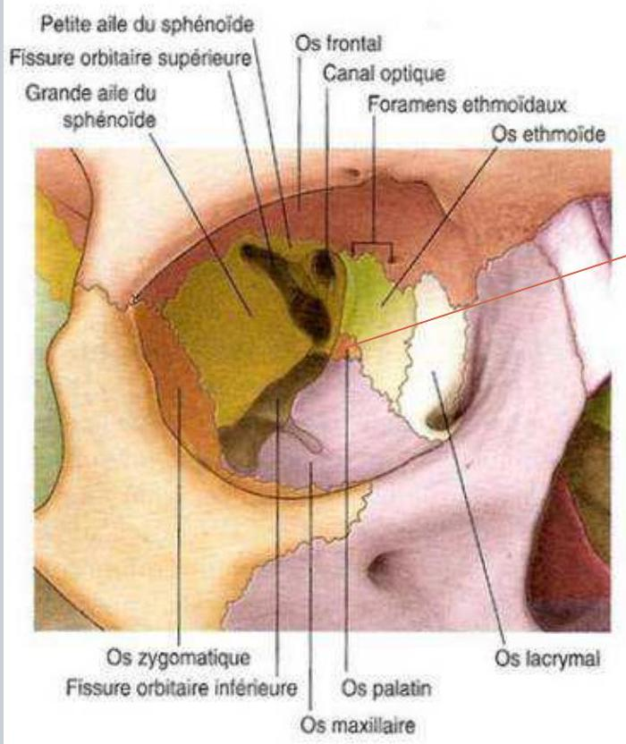

# Anatomie Dentaire
-------------------
- [Chapter 1](./chapter_1.md)
- [Chapter 2](./chapter_2.md)
- [Chapter 3](./chapter_3.md)

# Ostéologie de la face
------------------------
author: DR.

ATTIYA NOURDINE\\DMD, PHD STUDENT

#

# Introduction

- Elle est formée de 13 os fixes soudés entre eux et au crâne et d'un seul os mobile (mandibule).

- Les os fixes sont pairs:

- Les os maxillaires,

- Les os zygomatique,

- Les os lacrymaux,

- Les os propres du nez,

- Les os palatins

- Les cornets nasaux inférieurs.

# Introduction

- - Deux sont impairs :

- La mandibule : étage inférieur de la face

- Le vomer : étage supérieur de la face.

Participe à la cloison osseuse des fosses nasales.
N.

B.: L'éthmoïde et le sphénoïde sont des os de la base du crâne qui participent à la formation du squelette de la face.

# Introduction

Os frontalGlabelle -Incisure supra-orbitaire forameFace orbitaire -Os nasalOs nasal -Os lacrymalOs zygomatiqueOs zvgomatiqueFace orbitaireProcessus temporalForamenzygomatico-facialMaxillaireFace orbitaire -Foramen infra-orbitProcessus frontal.

Processus alvéolairÉpine nasaleantérieur alveolaire\\

.jpg)
Phènoïde

.jpg)

# I/ Le maxillaire (supérieur)

#  Os pair (deux os maxillaires) formant l'essentiel du squelette de l'étage moyen de la face.

Il est constitué d'un corps et de 4 processus : 1- le corps:
C'est le principal élément de l'os maxillaire, il a la forme d'une pyramide et participe à la constitution de la cavité orbitaire, des fosses nasales, de la fosse infra-temporaleet de la face.

# 2-- Le processus zygomatique:
Il s'étend latéralement pour s'unir avec le processus maxillaire de l'os zygomatique.

# I/ Le maxillaire (supérieur)

# 3- Le processus frontal:
Il se dirige vers le haut pour s'unir avec l'os nasal, l'os frontal, l'os ethmoïde et l'os lacrymal.

# 4-Le processus palatin:
Il forme avec son homonyme controlatérall'essentiel du palais osseux (les lames horizontales de l'os palatin forment la partie postérieure du palais osseux).

# 5- Le processus alvéolaire:
Il se situe à la partie inférieure de l'os et sert d'insertion à toutes les dents maxillaires ( 5 dents déciduales et 8 dents permanentes).

# I/ Le maxillaire (supérieur)

#  Le maxillaire est pneumatisé d'une grande cavité appelée sinus maxillaire.

#  Le sinus peut être le siège de plusieurs infections à l'origine de sinusites maxillaires.

Ces infections peuvent être d'origine dentaire.

#  Les racines des dents postérieures supérieures peuvent être projetées dans le sinus maxillaire: communication bucco-sinusienne après extraction.

#  Le maxillaire s'articule avec tous les autres os fixes de la face du côté homolatéral et s'unit avec l'os maxillaire controlatéral.

Il s'unit également avec les os de la base du crâne: l'ethmoïde et le sphénoïde.

# I/ Le maxillaire (supérieur)
La face en vue latérale

# I/ Le maxillaire (supérieur)
La face en vue antérieure (de face)

# II/L'os zygomatique

#  Os pair, c'est l'os de la pommette.

Il possède 3 processus:

# - Les processus frontal et maxillaire participent à la construction de l'orbite;  - Le processus temporal participe à la formation de l'arcade zygomatique.

#  De chaque côté, il s'unit avec l'os frontal et les os temporal et maxillaire homolatéraux.

# II/L'os zygomatique (malaire)

# II/L'os zygomatique

.jpg)

# III/ L'os lacrymal

# - Os pair, rectangulaire, mince et assez fragile.

#  Il constitue un élément de la paroi médiane de l'orbite et sa partie inférieure est un élément de la paroi latérale des fosses nasales.

La région en rapport avec le processus frontal de l'os maxillaire représente la fosse lacrymale contenant le sac lacrymal.

# III/ L'os lacrymal

# III/ L'os lacrymal

# IV/ Les os du nez (propre du nez+ cornet inf)

# - Os pairs qui forment la racine et l'arête du nez.

Sa
portion inférieure donne insertion aux cartilages nasaux et au cartilage septal.

De chaque côté, il s'unit avec l'os frontal et la lame perpendiculaire de l'os ethmoïde, l'os maxillaire homolatérale, et l'os nasal controlatéral.

#  Les os nasaux sont à distinguer des cornets inférieures.

#  Le cornet nasal inférieur pair est une lame osseuse recourbée appartenant à la paroi latérale des fosses nasales.

De chaque côté, il s'unit avec les os maxillaires, palatin et lacrymal homolatéraux ainsi qu'à l'ethmoïde.

# IV/ Les os du nez (propre du nez+ cornet inf)

# V/ Les os du nez (propre du nez+ cornet inf)

.jpg)
Right

.jpg)
Left

.jpg)

# IV/ Les os du nez (propre du nez+ cornet inf)

# V/ L'os palatin

#  Il participe à la formation du palais osseux (partie postérieure) et des parois des cavités nasales.

#  Il a la forme d'un L (majuscule) en vue latérale avec une portion verticale dite lame perpendiculaire participant à former la paroi latérale des fosses nasales et une horizontale qui participe à la formation du palais osseux postérieur.

#  Il présente également une petite saillie appelée apophyse pyramidale sur la face externe de la lame perpendiculaire.

# V/ L'os palatin

# - Un petit processus pyramidal:
Se dirige vers le bas et l'arrière à partir de la jonction des 2 parties perpendiculaire et horizontale.

#  Il s'articule avec l'os sphénoïde et l'os ethmoïde, avec l' os maxillaire et le cornet nasal inférieur homolatéral.

# V/ L'os palatin

# VI Le vomer

#  Os impair, qui a la forme d'un soc de charrue.

Il constitue la partie postéro-inférieure du septum nasal.

Os situé dans le plan médian, qui s'unit aux os sphénoïde et ethmoïde dans leurs portions médianes ainsi que sur la ligne médiane de la face supérieure du palais osseux, point de rencontre des deux os maxillaires et palatins.

Son bord postérieur est libre, ne s'unissant avec aucun autre os.

# VI/ Le vomer

# VII/ La mandibule (maxillaire inf)

Os impair qui constitue l'étage inférieure de la face, c'est le seul os mobile par l'action des muscles masticateurs.

#  Elle est constituée de deux parties, un corps et une branche verticale dite branche montante, et des processus:

#  Corps mandibulaire:
En forme de fer à cheval, possède dans sa partie supérieure un processus alvéolaire qui supporte les dents mandibulaires ( 5 dents déciduales, et 8 dents permanentes de chaque côté).

# VII/ La mandibule (maxillaire inf)

#  La branche verticale dite branche montante: Rejoint le corps de la mandibule de chaque côté au niveau d'un angle appelé `angle goniaque` ou `gonion`.

Sa face médiale est percée par le foramen mandibulaire ( épine de spix) dans lequel passe le nerf mandibulaire, branche du nerf trijumeau.

#  La partie sup de la BM est divisée par une échancrure:

#  Coroné en avant (insertion muscle temporal);

#  Col surmonté d'un condyle qui s'articule avec le temporal (ATM)

# VII/ La mandibule (maxillaire inf)

# VII/ La mandibule (maxillaire inf)

.jpg)

# récapitulation

# récapitulation

