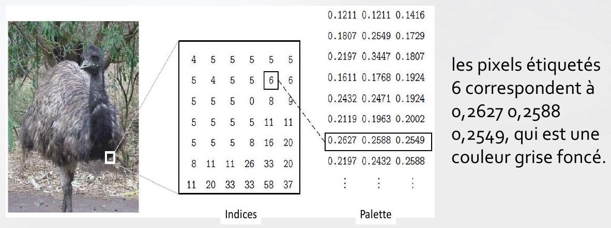

# Traitement et analyse d'images:
---------------------------------

### Plan:
- [Système de vision:]()
    - [Introduction, système visuel humain, couleur, perception,]()
    - [Acquisition et formats des images,]()
    - [Modélisation de la lumière et la colorimétrie.]()
- [Analyse des images:]()
    - [Histogramme : étirements, égalisation, manipulation, seuillage,]()
    - [Filtrage : lissage, rehaussement d'images, détection de contours]()
- [Applications:]()
    - [Compression d'images,]()
    - [Manipulation d'images,]()
    - [segmentation d'images.]()

### Introduction

Les êtres humains sont des créatures essentiellement visuelles:

- On compte beaucoup sur notre vision pour donner un sens au monde qui nous entoure. Ainsi on peut:

    - Identifier un visage en un instant,
    - Distinguer les couleurs,
    - Traiter une grande quantité d'informations visuelles très rapidement

- Ici, on va s'intéresser aux images simples : instantanés (snapshots) d'une scène visuelle.
Bien que le traitement d'image peut utiliser des scènes (vidéo).

Pour notre cas, une image est une simple photo qui représente quelques choses (des objets).

Elle peut être :

- Une photo d'une personne,

- Une photo de plusieurs personnes,

- Une photo des animaux,

- Une scène en plein-air,

- Une microphotographie d'un composant électronique,

- Une image médicale.
- ...

# C'est quoi le `traitement d'images`

Le traitement d'image consiste à changer la nature d'une image, afin de :

- Améliorer de l'information contenue pour aider à l'interprétation par l'homme,

- La rendre plus adapté pour une perception autonome de la machine.

Ces deux aspects sont très différents, et sont, les deux, importants pour le traitement d'image:

- Une procédure qui vérifie la condition $N^{\circ} 1$ peut être la procédure la plus mauvaise pour satisfaire la condition $N^{\circ}$,

- Les êtres humains préfèrent leurs images pleines (d'informations), claires et détaillées; les machines préfèrent que leurs images soient très simples et claire.

### 1. Améliorer de l'information contenue

Améliorer les contours d'une image pour la rendre plus nette:

> Notez comment la seconde image apparaît plus "claire`, c'est une image plus agréable.

Sharpening (traitement de la netteté) les contours est une opération vitale pour l'impression des images.

Suppression de `bruit` d'une image: le bruit étant des erreurs aléatoires dans l'image.

> Notez comment la seconde imageapparaît plus `nette`, c'est une image plus claire

Le bruit peut prendre de nombreuses formes différentes, chaque type de bruit nécessite une méthode différente pour sa suppression (réduction)

Correction du `de la motion blur: l'effet visuel de flou` flou dans une image:

.jpg)

> Notez que dans la deblurred image il est possible de lire la plaque ainsi que d'autres détails qui ne sont pas du tout clair dans l'image originale

Ce flou appelé aussi flou cinétique ou flou de mouvement : dû au mouvement rapide du sujet photographié pendant l'enreqistrement (la capture) .

### 2. Rendre l'image plus adaptée

Détection de contours dans une image: Cela peut être nécessaire pour la mesure des objets dans une image

.jpg)

> Seuls les contour sont visible dans la deuxième image

- On remarque qu'il peut être nécessaire d'augmenter légèrement le contraste de l'image originale, pour rendre les contours plus clairs.

Extraction (suppression) des détails d'une image:
Pour des raisons de mesure ou de comptage

>  La deuxième image présente une version floue dans laquelle des détails non-pertinentes ont été supprimés.

- Les petits détails sont disparus, alors, on peut par exemple, mesurer la taille et la forme de l'animal (bison) sans être `influencé` par les détails inutiles.

### 3. Applications

Le traitement d'images est utilisé dans plusieurs applications;

Presque tous les domaines de la science et la technologie peuvent faire usage de méthodes de traitement d'images.

- **Médecine**:

    - Inspection et Interprétation des images obtenues à partir des rayons X, IRM ou CAT scan,

    - l'analyse des cellules dans une image, des caryotypes (est l'arrangement standard de l'ensemble des chromosomes d'une cellule).
- **Agriculture**:

    - Satellite/vues aériennes de la terre, par exemple pour déterminer la quantité de terre utilisée à des fins différentes, ou pour enquêter sur l'adéquation des différentes régions pour différentes cultures,

    - L'inspection des fruits et légumes; distinguer les produits bons et frais des produits mauvais.

- **Industrie:** 

    - Inspection automatique d'objets sur une ligne de production,

    - L'inspection des échantillons de papier.

- **Application de la loi:** 
    - Analyse des empreintes digitales,
    - Sharpening (traitement de la netteté) ou suppression de flou (deblurring) des images radars.

# L'acquisition des images et l'échantillonnage

### Échantillonnage

L'échantillonnage se réfère au processus de numérisation d'une fonction continue.

Exemple $1 ~D$
$$y=\sin (x)+\frac{1}{3} \sin (3 x) .

- L'échantillonner à 10 valeurs espacées de $X$.

> Nous avons obtenu un sous-échantillonnage, car le nombre de points n'est pas suffisant pour reconstruire la fonction (d'origine).

- L'échantillonné à 100 points,

> On peut reconstruire la fonction; toutes ses propriétés peuvent être déterminées à partir de cet échantillonnage

Afin de veiller à ce que nous avons des points d'échantillonnage suffisant, il faut que la période d'échantillonnage ne soit pas supérieure à la moitié du moindre détail dans la fonction.

> C'est ce qu'on appelle le critère de Nyquist (énoncé comme étant le théorème d'échantillonnage)

### Images: 

- Pour obtenir un échantillon (numérique) d'une image, on peut commencer par une représentation continue d'une scène.

- Pour représenter une scène, on enregistre l'énergie réfléchie par celle-ci.

- Il existe plusieurs énergie qui peuvent être utiliser:
    - La lumière visible,
    - La lumière invisible: Rayon X, lumière UV, l'infra rouge ....

- Lumière visible:

La lumière est la source d'énergie prédominante pour les images; simplement parce qu'elle est la source d'énergie utilisée par les êtres humains pour observer directement.

> Beaucoup d'images numériques sont capturées en utilisant la lumière visible comme source d'énergie, ce qui a l'avantage d'être sûre, bon marché, facilement détectées et traitées rapidement avec le matériel approprié.

Deux méthodes, très populaires, pour produire une image numérique sont soit utilisant un appareil photo numérique ou un scanner à plat (flatbed scanner).

$$Caméra CCD (Charge Coupled Device):$$

- Le détecteur CCD assure la conversion d'un signal lumineux en un signal électrique,

- Une caméra CCD a, à la place du film d'habitude, une matrice de photosites: Ce sont des dispositifs électroniques en silicium dont la tension de sortie est proportionnelle à l'intensité de la lumière qui tombe sur eux (reçu)

- Pour une caméra reliée à un ordinateur (Webcam), des informations provenant des photosites sont ensuite acheminées vers un support de stockage approprié (disque dur)

- La capture d'image avec une caméra CCD

> - La sortie est un tableau de valeurs, chacune représente un point d'échantillonnage de la scène originale.
> - Les éléments de ce tableau sont appelés éléments de l'image (picture elements), ou plus simplement pixels.

- Scanner à plat (Flatbed scanner):

Cela fonctionne sur un principe similaire à la caméra CCD,

Au lieu de capturer à la fois l'image entière sur un grand tableau, une seule rangée (ligne) de photosites est déplacée à travers l'image, et capture ainsi ligne par ligne en se déplaçant.

- Utilisant autres sources d'énergie:

Bien que la lumière soit très populaire et facile à utiliser, autres sources d'énergie peuvent être utilisées pour créer une image numérique,

La lumière visible est une partie du spectre électromagnétique: rayonnement dans lequel l'énergie prend la forme d'ondes de différentes longueurs d'onde.

.jpg)

- Utilisant autres sources d'énergie:

**Rayons $X$**: ont une longueur d'onde plus courte que la lumière visible, et peuvent être utilisés pour résoudre des objets de petite taille que ceux traités avec la lumière visible.

> Les rayons $X$ sont bien entendu utilisés pour déterminer les structure d'objets qui sont cachés de la vue: comme les OS.

### 4. Images et images numériques

Supposons que nous prenons une image, une photo, par exemple acquise par un appareil numérique CCD.

> - On suppose que la photo est monochromatique: c'est-à-dire des nuances gris seulement), donc pas de couleur.
> - On peut considérer cette image comme étant une fonction à deux dimensions, où les valeurs de la fonction sont la luminosité de l'image à un moment donné,On peut supposer que les valeurs de la luminosité de l'image peuvent être des nombres réels dans l'intervalle o,o (noir) à 1,o (blanc)

Une telle fonction peut être tracée:

.jpg)

Une image numérique diffère d'une photo en ce que le $x, y$, et $f(x, y)$ sont tous des valeurs discrètes (échantillonnées).

- Terminologie:

Une image numérique peut être considérée comme un tableau (matrice 2D) de points échantillonnés à partir de l'image continu (photo), dont chacun a une luminosité particulière quantifiée;
> Ces points sont les pixels qui constituent l'image numérique.

Les pixels qui entourent un pixel donné constituent son voisinage
> Un voisinage peut être caractérisé par sa forme qui est une matrice: par exemple, on peut parler d'un voisinage de $3 \times 3$, ou d'un d'un voisinage de $5 \times 5$.

- Image numérique et voisinage

> les voisinages ont un nombre impair de lignes et de colonnes, ce qui garantit que le pixel courant est dans le centre de la zone ; voisinage $3 \times 3,9 \times 9$.[Sinon, il peut être nécessaire de spécifier quel pixel dans ce voisinage est le `pixel courant`

### Les aspects du traitement d'images

Il est commode de subdiviser les différents algorithmes de traitement d'images en des sousclasses.

Il existe différents algorithmes pour différentes tâches et problèmes
> Et souvent nous tenons à distinguer la nature de la tâche à accomplir.
> - Amélioration d'images (image enhancement),
> - Restauration d'images,
> - Segmentation d'images .

#### Amélioration d'images (image enhancement):

II s'agit du traitement d'une image de sorte que le résultat est plus approprié pour une application particulière.

**Example:**

- Sharpening (aiguiser) ou de la suppression de flou dans une image floue,
- Mètre en évidence les contours,
- Amélioration du contraste, ou de l'éclaircissement d'une image,
- Suppression de bruit,
- ...

#### Restauration d'images :

Cela peut être considéré comme inverser les dommages causés à une image par une cause connue,

***Exemple:***

- Suppression de flou causé par le mouvement linéaire,
- Suppression des distorsions optiques,
- Suppression des interférences périodique,
- ...

#### Segmentation d'images :

II s'agit de diviser une image en des éléments distinctifs, ou d'isoler certains aspects d'une image.

**Exemple:**

- Trouver des lignes, des cercles ou des formes particulières dans une image,

- Sur une photographie aérienne, identifier des voitures, arbres, bâtiments, ou des routes.

Ces classes ne sont pas disjointes; un algorithme donné peut être utilisé à la fois pour l'amélioration d'images ou pour la restauration d'images.

Toutefois, nous devrions être en mesure de décider ce que nous essayons de faire avec notre image:

> Simplement lui donner une meilleure apparence (amélioration), ou la suppression des dommages (restauration).

### Les étapes du traitement d'images

Nous allons examiner en détail une tâche particulière dans le monde réel, et de voir comment les classes cidessus peuvent être utilisés pour décrire les différentes étapes dans l'accomplissement de cette tâche.

**Exemple:**

La tache consiste en obtenir, par un processus automatique, les codes postaux dans les enveloppes.

- **L'acquisition de l'image:** Caméra CCD ou scanner,
- **Prétraitement:** Améliorer le contraste, la suppression du bruit, ou d'identifier les régions susceptibles de contenir le code postal.
- **Segmentation:** Extraction de la partie qui ne contient que le code postal,
- **Représentation et description:** Chercher des courbes, les trous et les coins qui nous permettrons de distinguer les différents chiffres qui constituent le code postal.
- **Reconnaissance et interprétation:** Attribuer des étiquettes à des objets en fonction de leurs descripteurs (de l'étape précédente), et assigner des significations à ces labels.

### Types d'images numériques

En général, il existe quatre types de base des images:

- Images binaires,
- Images à niveau de gris,
- Images couleurs,
- Images indexées.

#### Binaires

Chaque pixel est soit noir soit blanc.
> - Nous avons seulement besoin d'un bit par pixel.
> - Ces images peuvent donc être très efficaces en termes de stockage.

**Exemple:**

- Les images contenant du texte (imprimé ou écrit à la main),
- Les empreintes digitales,
- Les plans d'architecture,
- Les images contenant des contours.

> Nous n'avons que deux couleurs: blanc pour le contour et noir pour fond

#### A niveau de gris

Chaque pixel est une nuance de gris, normalement de o (noir) à 255 (blanc)

- Cette gamme signifie que chaque pixel peut être représenté par huit bits, soit exactement un octet,

- Il s'agit d'une gamme très naturelle pour le traitement d'images.

> 255 niveaux de gris différents sont suffisants pour la reconnaissance (présentation) de la plupart des objets naturels.

#### Couleurs

Appelées images couleurs vraies ou RVB

Chaque pixel a une couleur particulière; cette couleur est décrite par la quantité de Rouge, Vert et de Bleu.
> - Si chacune de ces composantes a un intervalle de o à 255 , ce qui donne un total de $255^{3}=16.777 .216$ couleurs différentes possibles dans l'image.
> - C'est assez de couleurs pour une image.

Puisque le nombre total de bits requis pour chaque pixel est de $24(8 \times 3)$, ces images sont aussi appelés images en couleur 24 -bit.

Une image couleur peut être considérée comme étant composé d'une "pile` de trois matrices, représentant les valeurs de rouge, vert et bleu pour chaque pixel.
> Cela signifie que pour chaque pixel correspond trois valeurs.

Types d'images numériques

Couleurs

<!-- image error -->

### Indexées

Dans les images couleurs : beaucoup de pixels ont la même couleur.

Pour plus de commodité de stockage et de manipulation de fichier image, une image indexée utilise une carte (map) de couleurs associée appelée palette de couleur:

- Une palette est simplement une liste de toutes les couleurs utilisées dans cette image,

- La valeur des pixels ne présente pas la couleur (comme pour une image RVB) mais un indice de la couleur dans la palette.

Cette présentation est pratique pour le cas d'une image a 256 couleurs ou moins, car pour le stockage les valeurs des indices ne requiert qu'un octet chacun.

Le format GIF ne permet que 256 couleurs ou moins dans chaque image

- Deux matrice: Indices et Palette
    - Dans Indices: les valeurs sont des indices dans la palette
    - Dans Palette: valeurs des couleurs rouge, vert et bleu
- Sans cette palette, l'image serait très sombre et non-coloré.
- La modification d'une entrée de la palette entraîne la modification de la couleur de tous les pixels référant à cette entrée.

#### Taille des fichiers images

La taille des fichiers d'image a tendance à être grande et ceci est directement liée à:

- la quantité d'information contenue
- et le type d'images.

**Exemple:**
Calculer les tailles (en bits, octets, Ko, Mo)respectives de trois images (de taille $512 \times 512$ ); 1binaire, 2- à niveau de gris, 3-couleur.

On suppose l'absence de compression, et on néglige les informations dans l'en-tête.

## Taille des fichiers images

|        | Binaire         | À niveau de gris   | Couleur           |
|:-------|:--------------- |:-------------------|:------------------|
| bits   | $262144$        | $262144 \times 8$  | $786432 \times 8$ |
| octets | $32768$         | $262144$           | $786432$          |
| Ko     | $32,768$        | $262,144$          | $786.432$         |
| Mo     | $\approx 0,033$ | $\approx 0,262$    |$ \approx 0,786$   |

Ils existent d'autres images qui ont une taille plus grande que celle présentée ici.

Par exemple, les images satellitaires peuvent être de l'ordre de plusieurs milliers de pixels dans chaque direction.

Perception des images

Une grande partie des processus de traitement d'images sont utilisés pour améliorer la qualité des images pour les êtres humains.

Nous devons donc être conscients des limites du système visuel humain.

La perception d'images se compose de deux étapes de base:

Capturer l'image avec l'œil,

Reconnaître et d'interpréter l'image (les objets dans l'image) avec le cortex visuel dans le cerveau.

La combinaison de ces étapes influence sur la façon dont nous percevons le monde autour de nous.

Il y a un certain nombre de choses à garder à l'esprit !!!

Perception des images

Les intensités observées varient en fonction de l'arrière-plan:
Un carré gris apparaît plus sombre s'il est placé sur un fond blanc que s'il était placé sur un fond noir.\\

Ceci est par ce que nous ne percevons pas les niveaux de gris comme ils le sont, mais plutôt leur différences avec leur entourage.

Perception des images

On peut observer des intensités inexistantes en barre dans une variation continue de niveaux de gris
l'intensité varie de façon continue du clair à l'obscurité si on la parcouru de gauche à droite.
> Toutefois, nos yeux vont voir des barres horizontales ( ou verticales) dans cette image
