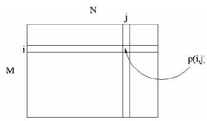
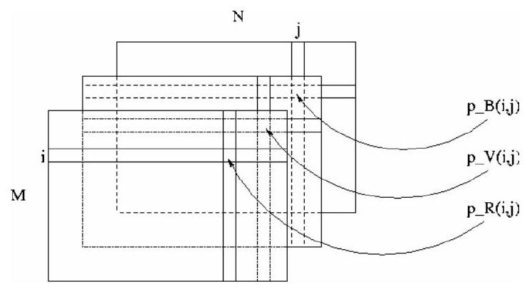

# Initiation au traitement d'images avec MATLAB
------------------------

# Table des matières
- [Introduction](./)
- [Lire et écrire des images sous Matlab](./)
- [Opérations géométriques](./)
- [Histogramme - seuillage](./)
- [Détection de contours](./)
- [Espace de couleurs](./)
- [Transformée de Fourier](./)
- [Conclusion](./)

### Introduction

- L'objectif de cette introduction au traitement d'images sous Matlab :

    - présenter la notion d'image

    - effectuer des opérations simples d'analyse d'images telles que la détection de contours, le changement d'espace de couleur...

- Le traitement d'images est un thème de recherche situé entre l'informatique et le traitement du signal.

### I.1. Rappels sur la notion d'image

- Une image réelle est obtenue à partir d'un signal continu bidimensionnel comme par exemple un appareil photo ou une caméra...

- Sur un ordinateur, on ne peut pas représenter de signaux continus, on travaille donc sur des valeurs discrètes.

- Définition: Une image numérique est définie comme un signal fini bidimensionnel échantillonné à valeurs quantifiées dans un certain espace de couleurs.

Elle est constituée de points (pixels).

- Signal fini : une image possède des dimensions finies, exemple : 640x480, 800x600 points...

- Signal bidimensionnel : une image possède deux dimensions : largeur, hauteur.

- Signal échantillonné : les pixels d'une image sont régulièrement espacés sur une grille carrée.

- Valeurs quantifiées : les valeurs des pixels appartiennent à un intervalle borné connu.

- Espace de couleur : il existe de nombreuses façon de percevoir les couleurs d'une image, l'espace de représentation le plus connu est l'espace rgb (rouge-vertbleu).

p(i,j) est le niveau de gris du pixel de coordonnées ligne i et colonne $j$ dans l'image. $p(i, j) \in[0, Ng]$.

Les valeurs des niveaux de gris sont des entiers.

### I.1.1. Image binaire

- Une image binaire est une image $M x N$ où chaque point peut prendre uniquement la valeur 0 ou $1 .$

- Les pixels sont noirs (0) ou blancs (1).

- Le niveau de gris est codé sur un bit (Binary digIT).

# I.1.2. Image en niveaux de gris

- Une image ne niveaux de gris autorise un dégradé de gris entre le noir et le blanc.

- En général, on code le niveau de gris sur un octet ( 8 bits) soit 256 nuances de dégradé.

L'expression de la valeur du niveau de gris avec $Ng=256$ devient: $p(i, j) \in[0,255]$. 

- Une image couleur est la composition de trois (ou plus) images en niveaux de gris sur trois (ou plus) composantes.

- On définit donc trois plans de niveaux de gris, un rouge, un vert et un bleu.

- La couleur finale est obtenue par synthèse additive des ces trois (ou plus) composantes.

On a les relations sur les niveaux de gris: $p_{-} R(i, j) \in[0,255], p_{-} V(i, j) \in[0,255]$, $P_{l} B(i, j) \in[0,255]$.

On voit bien sur la figure qu'une image couleur est en fait base.

# I.2. Rappels sous Matlab :

- Une image Matlab est une matrice bidimensionnelle de valeurs entières ou réelles.

- Les principales fonctions de traitement d'images sous Matlab se trouvent dans la boîte à outils (toolbox) image processing (traitement d'images).

- L'aide sur cette boîte à outils est obtenue en tapant help images en ligne de commande de Matlab.

- Ensuite, l'aide sur une commande particulière est obtenue en tapant help suivi du nom de la commande, par exemple help edge.

# Image display.

- colorbar - Display colorbar (MATLAB Toolbox).

- getimage - Get image data from axes.

- image - Create and display image object (MATLAB Toolbox).

- imagesc - Scale data and display as image (MATLAB Toolbox).

- immovie - Make movie from multiframe indexed image.

- imshow - Display image. montage - Display multiple image frames as rectangular montage.

- subimage - Display multiple images in single figure.

- truesize - Adjust display size of image.

- warp - Display image as texture-mapped surface.

- zoom - Zoom in and out of image or 2-D plot (MATLAB Toolbox).

### Image file I/O.

- imfinfo - Return information about image file (MATLAB Toolbox).

- imread - Read image file (MATLAB Toolbox).

- imwrite - Write image file (MATLAB Toolbox).

### Geometric operations.

- imcrop - Crop image.

- imresize - Resize image.

- imrotate - Rotate image.

- interp2 - 2-D data interpolation (MATLAB Toolbox).

### Pixel values and statistics.

- corr2 - Compute 2-D correlation coefficient.

- imcontour - Create contour plot of image data.

- imfeature - Compute feature measurements for image regions.

- imhist - Display histogram of image data.

- impixel - Determine pixel color values.

- improfile - Compute pixel-value cross-sections along line segments.

- mean2 - Compute mean of matrix elements.

- pixval - Display information about image pixels.

- std2 - Compute standard deviation of matrix elements.

### Image analysis.

- edge - Find edges in intensity image.

- qtdecomp - Perform quadtree decomposition.

- qtgetblk - Get block values in quadtree decomposition. qtsetblk - Set block values in quadtree decomposition.

### Image enhancement.

- histeq - Enhance contrast using histogram equalization.

- imadjust - Adjust image intensity values or colormap.

- imnoise - Add noise to an image. medfilt2 - Perform 2-D median filtering.

- ordfilt2 - Perform 2-D order-statistic filtering.

- wiener2 - Perform 2-D adaptive noise-removal filtering.

### Linear filtering.

- conv2 - Perform 2-D convolution (MATLAB Toolbox).

- convmtx2 - Compute 2-D convolution matrix. convn Perform N-D convolution (MATLAB Toolbox).

- filter2 - Perform 2-D linear filtering (MATLABToolbox).

- fspecial - Create predefined filters.

### Linear 2-D filter design.

- freqspace - Determine 2-D frequency response spacing (MATLABToolbox).

- freqz2 - Compute 2-D frequency response.

- fsamp2 - Design 2-D FIR filter using frequency sampling.

- ftrans2 - Design 2-D FIR filter using frequency transformation.

- fwind1 - Design 2-D FIR filter using 1-D window method.

- fwind2 - Design 2-D FIR filter using 2-D window method.

### Image transforms

- dct2 - Compute 2-D discrete cosine transform.

- dctmtx - Compute discrete cosine transform matrix.

- fft2 - Compute 2-D fast Fourier transform (MATLAB Toolbox).

- fftn - Compute N-D fast Fourier transform (MATLAB Toolbox).

- fftshift - Reverse quadrants of output of FFT (MATLAB Toolbox).

- idct2 - Compute 2-D inverse discrete cosine transform.

- ifft2 - Compute 2-D inverse fast Fourier transform (MATLAB Toolbox).

- ifftn - Compute N-D inverse fast Fourier transform (MATLAB Toolbox).

- iradon - Compute inverse Radon transform. phantom - Generate a head phantom image.

- radon - Compute Radon transform.

### Neighborhood and block processing.

- bestblk - Choose block size for block processing.

- blkproc - Implement distinct block processing for image.

- col2im - Rearrange matrix columns into blocks.

- colfilt - Perform neighborhood operations using columnwise functions.

- im2col - Rearrange image blocks into columns.

- nlfilter - Perform general sliding-neighborhood operations.

### Binary image operations.

- applylut - Perform neighborhood operations using lookup tables.

- bwarea - Compute area of objects in binary image.

- bweuler - Compute Euler number of binary image.

- bwfill - Fill background regions in binary image.

- bwlabel - Label connected components in binary image.

- bwmorph - Perform morphological operations on binary image.

- bwperim - Determine perimeter of objects in binary image.

- bwselect - Select objects in binary image.

- dilate - Perform dilation on binary image.

- erode - Perform erosion on binary image.

- makelut - Construct lookup table for use with applylut.

### Region-based processing.

- roicolor - Select region of interest, based on color.

- roifill - Smoothly interpolate within arbitrary region.

- roifilt2 - Filter a region of interest.

- roipoly - Select polygonal region of interest.

### Colormap manipulation.

- brighten - Brighten or darken colormap (MATLAB Toolbox).

- cmpermute - Rearrange colors in colormap.

- cmunique - Find unique colormap colors and corresponding image.

- colormap - Set or get color lookup table (MATLAB Toolbox).

- imapprox - Approximate indexed image by one with fewer colors.

- rgbplot - Plot RGB colormap components (MATLAB Toolbox).

### Color space conversions.

- hsv2rgb - Convert HSV values to RGB color space (MATLAB Toolbox).

- ntsc2rgb - Convert NTSC values to RGB color space.

- rgb2hsv - Convert RGB values to HSV color space (MATLAB Toolbox).

- rgb2ntsc - Convert RGB values to NTSC color space.

- rgb2ycbcr - Convert RGB values to YCBCR color space.

- ycbcr2rgb - ConvertYCBCR values to RGB color space.

### Imager types and type conversions.

- gray2ind - Convert intensity image to indexed image.

- grayslice - Create indexed image from intensity image by thresholding.

- im2bw - Convert image to binary image by thresholding.

- im2double - Convert image array to double precision.

- im2uint8 - Convert image array to 8-bit unsigned integers.

- im2uint16 - Convert image array to 16-bit unsigned integers.

- ind2gray - Convert indexed image to intensity image.

- ind2rgb - Convert indexed image to RGB image (MATLAB Toolbox).

- isbw - Return true for binary image.

- isgray - Return true for intensity image.

- isind - Return true for indexed image.

- isrgb - Return true for RGB image.

- mat2gray - Convert matrix to intensity image.

- rgb2gray - Convert RGB image or colormap to grayscale.

- rgb2ind - Convert RGB image to indexed image.

### Demos.

- dctdemo - 2-D DCT image compression demo.

- edgedemo - Edge detection demo.

- firdemo - 2-D FIR filtering and filter design demo.

- imadjdemo - Intensity adjustment and histogram equalization demo.

- nrfiltdemo - Noise reduction filtering demo.

- qtdemo - Quadtree decomposition demo.

- roidemo - Region-of-interest processing demo.

- Comme on peut le constater, la boîte à outils images de Matlab contient de nombreuses fonctions qui permettent le développement facile et rapide d'algorithmes en fonction du problème à traiter.

- C'est un très bon outil pour la validation de méthodes de traitement d'images appliquées à un problème particulier. 

